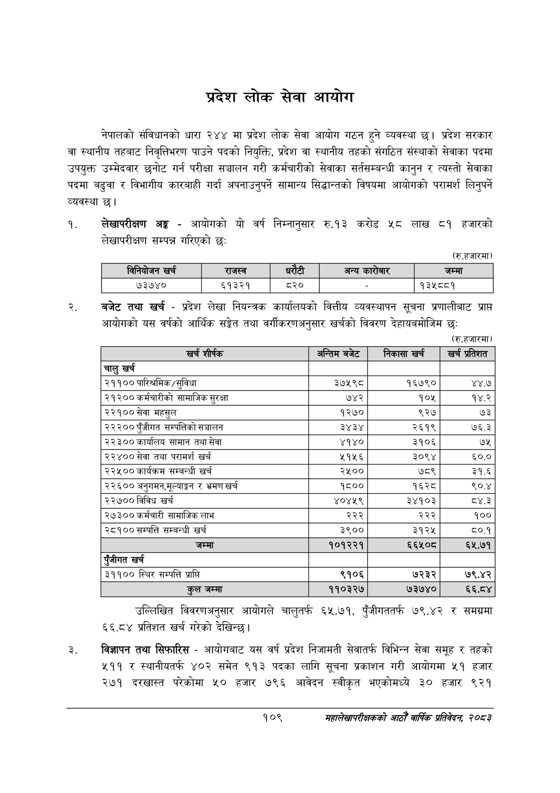

# Page 131 QA

## Rendered page


## Extracted text

```text
प्रदेश लोक सेवा आयोग
नेपालको संविधानको धारा २४४ मा प्रदेश लोक सेवा आयोग गठन हुने व्यवस्था छ। प्रदेश सरकार वा स्थानीय तहबाट निवृत्तिभरण पाउने पदको नियुक्ति, प्रदेश वा स्थानीय तहको संगठित संस्थाको सेवाका पदमा उपयुक्त उम्मेदवार छनोट गर्न परीक्षा सञ्चालन गरी कर्मचारीको सेवाका सर्तसम्बन्धी कानुन र त्यस्तो सेवाका पदमा बढुवा र विभागीय कारबाही गर्दा अपनाउनुपर्ने सामान्य सिद्धान्तको विषयमा आयोगको परामर्श लिनुपर्ने व्यवस्था छ।
लेखापरीक्षण अङ्ग -आयोगको यो वर्ष निम्नानुसार रु.१३ करोड ५८ लाख ८१ हजारको लेखापरीक्षण सम्पन्न गरिएको छः:
(रु.हजारमा)
बजेट तथा खर्च -प्रदेश लेखा नियन्त्रक कार्यालयको वित्तीय व्यवस्थापन सूचना प्रणालीबाट प्राप्त आयोगको यस वर्षको आर्थिक सङ्गेत तथा वर्गीकरणअनुसार खर्चको विवरण देहायबमोजिम छः
(रु.हजारमा)
उल्लिखित विवरणअनुसार आयोगले चालुतर्फ ६५.७१, पुँजीगततर्फ ७९.४२ र समग्रमा ६६.८४ प्रतिशत खर्च गरेको देखिन्छ।
विज्ञापन तथा सिफारिस -आयोगबाट यस वर्ष प्रदेश निजामती सेवातर्फ विभिन्न सेवा समूह र तहको ५११ र स्थानीयतर्फ ४०२ समेत ९१३ पदका लागि सूचना प्रकाशन गरी आयोगमा ५१ हजार २७१ दरखास्त परेकोमा ५२० हजार ७९६ आवेदन स्वीकृत भएकोमध्ये ३० हजार ९२१
१०९
सहालेखापरीक्षकको आठो वाषिकि प्रतिवेदन २०८२

| ानिबोजन खर्च | राजस्व |  |  | अन्य कारोबार | जम्मा |
| --- | --- | --- | --- | --- | --- |
| ७३७४० | ६१३२१ | ८२० |  |  | ९३५५९ |

| खच शीर्षक | अन्तिम बबेट | निकासा खर | खच प्रतिशत |
| --- | --- | --- | --- |
| चालु खर्च |  |  |  |
| २११०० पारिश्रमिक/सुविधा | ३७५९८ | १६७९० | ४४.७ |
| २९३०० कर्मचारीको साभाजिक सुरक्षा | ७४२ | १०४५ | १४.२ |
| २२१०० सेवा महसुल | १२७० | ९२७ | ७३ |
| २२२०० पुँजीगत सम्पत्तिको सञ्चालन | ३४३४ | २६१९ | ७६.३ |
| २२३०० कार्यालय सामान तथा सेवा | ४१४० | ३१०६ | ७५ |
| २२४०० सेवा तथा परामर्श खर्च | ५१५६ | ३०९४ | ६०.० |
| २२५०० कार्यक्रम सम्बन्धी खर्च | २५०० | ७८९ | ३१.६ |
| २२६०० अनुगमन,भूल्याङ्गन र भ्रमण खर्च | १८०० | १६२८ | ९०.४ |
| २२७०० विविध खर्च | ४०४५९ | ३४१०३ | ८्४.३ |
| २७३०० कर्मचारी सामाजिक लाभ | २२२ | २२२ | १०० |
| २८१०० सम्पत्ति सम्बन्धी खर्च | ३९०० | ३१२५ |  |
|  | १०९३३९ | ६६४५०८ | ६५.७१ |
| एंजीगत खर्च |  |  |  |
| ३११०० स्थिर सम्पत्ति प्राप्ति | ९१०६ | ७२३२ | ७९.४२ |
| जम्मा | ११०३२७ | ७३७४० | ६६.८४ |
```

## Flags
- table_page
- medium_quality_table
