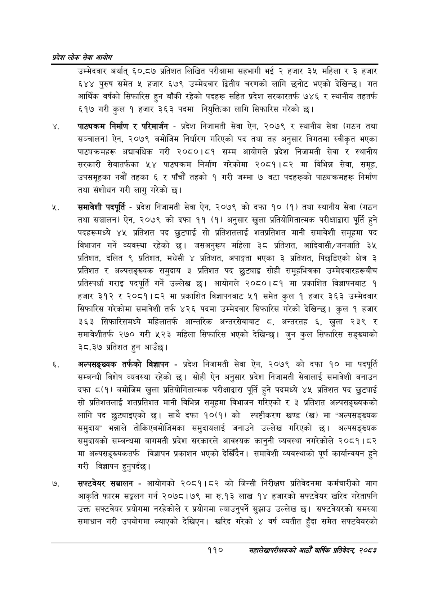

# Page 132 QA

## Rendered page


## Extracted text

```text
प्रदेश लोक सेवा आयोग
उम्मेदवार अर्थात्‌ ६०.८७ प्रतिशत लिखित परीक्षामा सहभागी भई २ हजार ३५ महिला र ३ हजार ६४४ पुरुष समेत ५ हजार ६७९ उम्मेदवार द्वितीय चरणको लागि छनोट भएको देखिन्छ। गत आर्थिक वर्षको सिफारिस हुन बाँकी रहेको पदहरू सहित प्रदेश सरकारतर्फ ७४६ र स्थानीय तहतर्फ ६१७ गरी कुल १ हजार ३६३ पदमा नियुक्तिका लागि सिफारिस गरेको छ।
पाठ्यक्रम निर्माण र परिमार्जन -प्रदेश निजामती सेवा ऐन, २०७९ र स्थानीय सेवा (गठन तथा सञ्चालन) ऐन, २०७९ बमोजिम निर्धारण गरिएको पद तथा तह अनुसार विगतमा स्वीकृत भएका पाठ्यक्रमहरू अद्यावधिक गरी २०८०।८१ सम्म आयोगले प्रदेश निजामती सेवा र स्थानीय सरकारी सेवातर्फका ५४ पाठ्यक्रम निर्माण गरेकोमा २०८१।८२ मा विभिन्न सेवा, समूह, उपसमूहका नवौं तहका ६ र पाँचौं तहको १ गरी जम्मा ७ वटा पदहरूको पाठ्यक्रमहरू निर्माण तथा संशोधन गरी लागु गरेको छ।
समावेशी पदपूर्ति -प्रदेश निजामती सेवा ऐन, २०७९ को दफा १० (१) तथा स्थानीय सेवा (गठन तथा सञ्चालन) ऐन, २०७९ को दफा ११ (१) अनुसार खुला प्रतियोगितात्मक परीक्षाद्वारा पूर्ति हुने पदहरूमध्ये ४५ प्रतिशत पद छुट्याई सो प्रतिशतलाई शतप्रतिशत मानी समावेशी समूहमा पद विभाजन गर्ने व्यवस्था रहेको जसअनुरूप महिला ३८ प्रतिशत, आदिवासी/जनजाति ३५ प्रतिशत, दलित ९ प्रतिशत, मधेसी ४ प्रतिशत, अपाङ्गता भएका ३ प्रतिशत, पिछडिएको क्षेत्र ३ प्रतिशत र अल्पसङ्ख्यक समुदाय ३ प्रतिशत पद छुट्याइ सोही समूहभित्रका उम्मेदवारहरूबीच प्रतिस्पर्धा गराइ पदपूर्ति गर्ने उल्लेख छ। आयोगले २०८०।८१ मा प्रकाशित विज्ञापनबाट १ हजार ३१२ र २०८१।८२ मा प्रकाशित विज्ञापनबाट ५१ समेत कुल १ हजार ३६३ उम्मेदवार सिफारिस गरेकोमा समावेशी तर्फ ४२६ पदमा उम्मेदवार सिफारिस गरेको देखिन्छ। कुल १ हजार ३६३ सिफारिसमध्ये महिलातर्फ आन्तरिक अन्तरसेवाबाट , अन्तरतह , खुला २३९ र समावेशीतर्फ २७० गरी ५२३ महिला सिफारिस भएको देखिन्छ। जुन कुल सिफारिस सङ्ख्याको ३८.३७ प्रतिशत हुन आउँछ।
अल्पसङ्ख्यक तर्फको विज्ञापन -प्रदेश निजामती सेवा ऐन, २०७९ को दफा १० मा पदपूर्ति सम्बन्धी विशेष व्यवस्था रहेको छ। सोही ऐन अनुसार प्रदेश निजामती सेवालाई समावेशी बनाउन दफा ८(१) बमोजिम खुला प्रतियोगितात्मक परीक्षाद्वारा पूर्ति हुने पदमध्ये ४५ प्रतिशत पद छुट्याई सो प्रतिशतलाई शतप्रतिशत मानी विभिन्न समूहमा विभाजन गरिएको र ३ प्रतिशत अल्पसङ्ख्यकको लागि पद छुट्याइएको छ। साथै दफा १०(१) को स्पष्टीकरण खण्ड (ख) मा "अल्पसङ्ख्यक समुदाय" भन्नाले तोकिएबमोजिमका समुदायलाई जनाउने उल्लेख गरिएको छ। अल्पसङ्ख्यक समुदायको सम्बन्धमा बागमती प्रदेश सरकारले आवश्यक कानुनी व्यवस्था नगरेकोले २०८१। ८२ मा अल्पसङ्ख्यकतर्फ विज्ञापन प्रकाशन भएको देखिँदैन। समावेशी व्यवस्थाको पूर्ण कार्यान्वयन हुने गरी विज्ञापन हुनुपर्दछ |
सफ्टवेयर सञ्चालन -आयोगको २०८१।८२ को जिन्सी निरीक्षण प्रतिवेदनमा कर्मचारीको माग आकृति फारम सङ्कलन गर्न २०७८।७९ मा रु.१३ लाख १४ हजारको सफ्टवेयर खरिद गरेतापनि उक्त सफ्टवेयर प्रयोगमा नरहेकोले र प्रयोगमा ल्याउनुपर्ने सुझाउ उल्लेख छ। सफ्टवेयरको समस्या समाधान गरी उपयोगमा ल्याएको देखिएन। खरिद गरेको ४ वर्ष व्यतीत हुँदा समेत सफ्टवेयरको
११०
सहालेखापरीक्षकको आठौँ वाषिकि प्रतिवेदन २०८२
```

## Flags
- None
