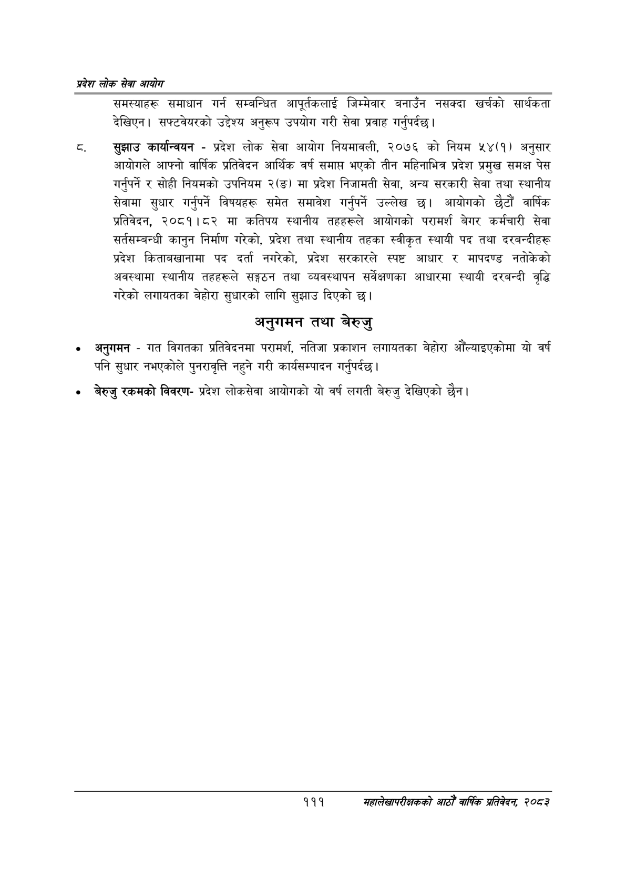

# Page 133 QA

## Rendered page


## Extracted text

```text
प्रदेश लोक सेवा आयोग
समस्याहरू समाधान गर्न सम्बन्धित आपूर्वकलाई जिम्मेवार बनाउँन नसक्दा खर्चको सार्थकता देखिएन। सफ्टवेयरको उद्देश्य अनुरूप उपयोग गरी सेवा प्रवाह गर्नुपर्दछ |
सुझाउ कार्यान्वयन -प्रदेश लोक सेवा आयोग नियमावली, २०७६ को नियम ५४(१) अनुसार आयोगले आफ्नो वार्षिक प्रतिवेदन आर्थिक वर्ष समाप्त भएको तीन महिनाभित्र प्रदेश प्रमुख समक्ष पेस गर्नुपर्ने र सोही नियमको उपनियम २(ङ) मा प्रदेश निजामती सेवा, अन्य सरकारी सेवा तथा स्थानीय सेवामा सुधार गर्नुपर्ने विषयहरू समेत समावेश गर्नुपर्ने उल्लेख छ। आयोगको छैटौं वार्षिक प्रतिवेदन, २०८१।८२ मा कतिपय स्थानीय तहहरूले आयोगको परामर्श बेगर कर्मचारी सेवा सर्तसम्बन्धी कानुन निर्माण गरेको, प्रदेश तथा स्थानीय तहका स्वीकृत स्थायी पद तथा दरबन्दीहरू प्रदेश किताबखानामा पद दर्ता नगरेको, प्रदेश सरकारले स्पष्ट आधार र मापदण्ड नतोकेको अवस्थामा स्थानीय तहहरूले सङ्गठन तथा व्यवस्थापन सर्वेक्षणका आधारमा स्थायी दरबन्दी वृद्धि गरेको लगायतका बेहोरा सुधारको लागि सुझाउ दिएको छ।
अनुगमन तथा बेरुजु
० अनुगमन -गत विगतका प्रतिवेदनमा परामर्श, नतिजा प्रकाशन लगायतका बेहोरा औँल्याइएकोमा यो वर्ष पनि सुधार नभएकोले पुनरावृत्ति नहुने गरी कार्यसम्पादन गर्नुपर्दछ |
० बेरुजु रकमको विवरणप्रदेश लोकसेवा आयोगको यो वर्ष लगती बेरुजु देखिएको |
१११
सहालेखापरीक्षकको आठौँ वाषिकि प्रतिवेदन २०८२
```

## Flags
- None
