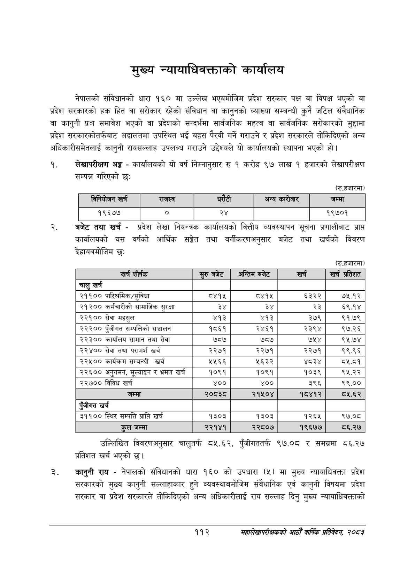

# Page 134 QA

## Rendered page


## Extracted text

```text
मुख्य न्यायाधिवक्ताको कार्यालय
नेपालको संविधानको धारा १६० मा उल्लेख भएबमोजिम प्रदेश सरकार पक्ष वा विपक्ष भएको वा प्रदेश सरकारको हक हित वा सरोकार रहेको संविधान वा कानुनको व्याख्या सम्बन्धी कुनै जटिल संवैधानिक वा कानुनी प्रश्न समावेश भएको वा प्रदेशको सन्दर्भमा सार्वजनिक महत्व वा सार्वजनिक सरोकारको मुद्दामा प्रदेश सरकारकोतर्फबाट अदालतमा उपस्थित भई बहस पैरवी गर्ने गराउने र प्रदेश सरकारले तोकिदिएको अन्य अधिकारीसमेतलाई कानुनी रायसल्लाह उपलब्ध गराउने उद्देश्यले यो कार्यालयको स्थापना भएको ३ |
लेखापरीक्षण अङ्ग -कार्यालयको यो वर्ष निम्नानुसार रु १ करोड ९७ लाख १ हजारको लेखापरीक्षण सम्पन्न गरिएको छः
(रु.हजारमा)
१९६७७ २. बजेट तथा खर्च -प्रदेश लेखा नियन्त्रक न कार्यालयको वित्तीय व्यवस्थापन सूचना प्रणालीबाट प्राप्त कार्यालयको यस वर्षको आर्थिक सङ्गेत तथा वर्गीकरणअनुसार बजेट तथा खर्चको विवरण देहायबमोजिम छ:
(रु.हजारमा)
उल्लिखित विवरणअनुसार चालुतर्फ ८५.६२, पुँजीगततर्फ ९७.०८ र समग्रमा ८६.२७ प्रतिशत खर्च भएको छ।
कानुनी राय -नेपालको संविधानको धारा १६० को उपधारा (५) मा मुख्य न्यायाधिवक्ता प्रदेश सरकारको मुख्य कानुनी सल्लाहाकार हुने व्यवस्थाबमोजिम संवैधानिक एवं कानुनी विषयमा प्रदेश सरकार वा प्रदेश सरकारले तोकिदिएको अन्य अधिकारीलाई राय सल्लाह दिनु मुख्य न्यायाधिवक्ताको
११२
सहालेखापरीक्षकको आठो वाषिकि प्रतिवेदन २०८२

| विनिवोजन खर्च | राजस्व |  |  | अन्य कारोबार | जम्मा |
| --- | --- | --- | --- | --- | --- |
| १९६७७ | ० | २४ |  |  | १९७०१ |

| खर्च शीर्षक | सुरु बजेट | अन्तिम बजेट | खर्च | खर्च प्रतिशत |
| --- | --- | --- | --- | --- |
| चालु खर्च |  |  |  |  |
| २११०० पारिश्रमिक/सुविधा | ८४१५ | ८४१५ | ६३२२ | ७५.१२ |
| २१२०० कर्मचारीको सामाजिक सुरक्षा | ३४ | ३४ | २३ | ६९.१४ |
| २२१०० सेवा महसुल | ४१३ | ४१३ | ३७९ | ९१.७९ |
| २२२०० पुँजीगत सम्पतिको सञ्चालन | १८६१ | २४६१ | २३९४ | ९७.२६ |
| २२३०० कार्यालय सामान तथा सेवा | ७८७ | ७८७ | ७५४ | ९५.७४ |
| २२४०० सेवा तथा परामर्श खर्च | २२७१ | २२७१ | २२७१ | ९९.९६ |
| २२५०० कार्यक्रम सम्बन्धी खर्च | २५६६ | ५६३२ | ४८३४ | ८५.८१ |
| २२६०० अनुगमन, भूल्याङ्गन र भ्रमण खर्च | १०९१ | १०९१ | १०३९ | ९५.२२ |
| २२७०० विविध खर्च | ४०० | ४०० | ३९६ | ९९.०० |
| 'जम्मा | २०३८ | २१५०४ | १८४१२ | व२.६२ |
| पूँजीगत खर्च |  |  |  |  |
| ३११०० स्थिर सम्पत्ति प्राप्ति खर्च | १३०३ | १३०३ | १२६५ | ९७.०८ |
| कुल जम्मा | २२१४१ | २२८०७ | १९६७७ | ८६.२७ |
```

## Flags
- table_page
- medium_quality_table
