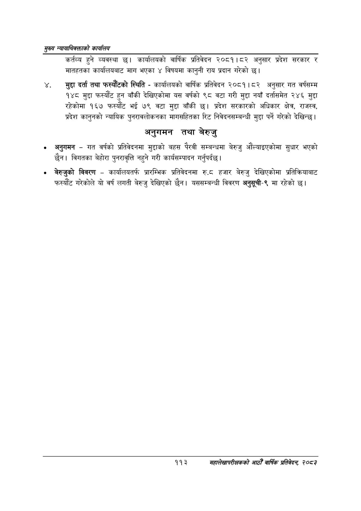

# Page 135 QA

## Rendered page


## Extracted text

```text
सृख्य न्यायाधिवक्ताको कायलिय
कर्तव्य हुने व्यवस्था छ। कार्यालयको वार्षिक प्रतिवेदन २०८१।८२ अनुसार प्रदेश सरकार र मातहतका कार्यालयबाट माग भएका ४ विषयमा कानुनी राय प्रदान गरेको छ।
मुद्दा दर्ता तथा फस्यौटको स्थिति -कार्यालयको वार्षिक प्रतिवेदन २०८१।८२ अनुसार गत वर्षसम्म १४८ मुद्दा फस्यौट हुन बाँकी देखिएकोमा यस वर्षको ९८ वटा गरी मुद्दा नयाँ दर्तासमेत २४६ मुद्दा रहेकोमा १६७ फस्यौट भई ७९ वटा मुद्दा बाँकी छ। प्रदेश सरकारको अधिकार क्षेत्र, राजस्व, प्रदेश कानुनको न्यायिक पुनरावलोकनका मागसहितका रिट निवेदनसम्बन्धी मुद्दा पर्ने गरेको देखिन्छ।
अनुगमन तथा बेरुजु
अनुगमन -गत वर्षको प्रतिवेदनमा मुद्दाको बहस पैरवी सम्बन्धमा बेरुजु औंल्याइएकोमा सुधार भएको छैन। विगतका बेहोरा पुनरावृत्ति नहुने गरी कार्यसम्पादन गर्नुपर्दछ |
बेरुजुको विवरण -कार्यालयतर्फ प्रारम्भिक प्रतिवेदनमा रु.८ हजार बेरुजु देखिएकोमा प्रतिक्रियाबाट फस्यौट गरेकोले यो वर्ष लगती बेरुजु देखिएको छैन। यससम्बन्धी विवरण अनुसूची-९ मा रहेको
११३
सहालेखापरीक्षकको आठौँ वाषिकि प्रतिवेदन २०८२
```

## Flags
- None
