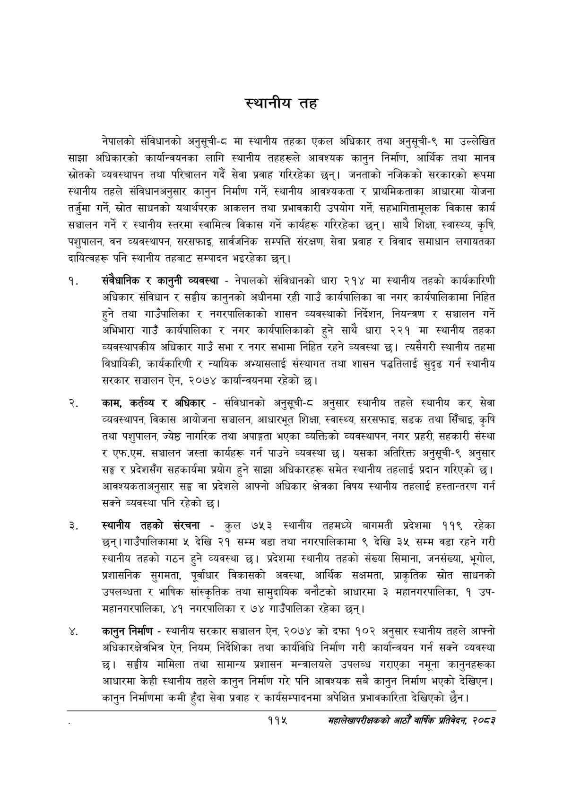

# Page 139 QA

## Rendered page


## Extracted text

```text
स्थानीय तह
नेपालको संविधानको अनुसूची-८ मा स्थानीय तहका एकल अधिकार तथा अनुसूची-९ मा उल्लेखित साझा अधिकारको कार्यान्वयनका लागि स्थानीय तहहरूले आवश्यक कानुन निर्माण, आर्थिक तथा मानव स्रोतको व्यवस्थापन तथा परिचालन गर्दै सेवा प्रवाह गरिरहेका छन्‌। जनताको नजिकको सरकारको रूपमा स्थानीय तहले संविधानअनुसार कानुन निर्माण गर्ने, स्थानीय आवश्यकता र प्राथमिकताका आधारमा योजना तर्जुमा गर्ने, स्रोत साधनको यथार्थपरक आकलन तथा प्रभावकारी उपयोग गर्ने, सहभागितामूलक विकास कार्य सञ्चालन गर्ने र स्थानीय स्तरमा स्वामित्व विकास गर्ने कार्यहरू गरिरहेका छन्‌। साथै शिक्षा, स्वास्थ्य, कृषि, पशुपालन, वन व्यवस्थापन, सरसफाइ, सार्वजनिक सम्पत्ति संरक्षण, सेवा प्रवाह र विवाद समाधान लगायतका दायित्वहरू पनि स्थानीय तहबाट सम्पादन भइरहेका छन्‌।
संवैधानिक र कानुनी व्यवस्था -नेपालको संविधानको धारा २१४ मा स्थानीय तहको कार्यकारिणी अधिकार संविधान र सङ्घीय कानुनको अधीनमा रही गाउँ कार्यपालिका वा नगर कार्यपालिकामा निहित हुने तथा गाउँपालिका र नगरपालिकाको शासन व्यवस्थाको निर्देशन, नियन्त्रण र सञ्चालन गर्ने अभिभारा गाउँ कार्यपालिका र नगर कार्यपालिकाको हुने साथै धारा २२१ मा स्थानीय तहका व्यवस्थापकीय अधिकार गाउँ सभा र नगर सभामा निहित रहने व्यवस्था छ। त्यसैगरी स्थानीय तहमा विधायिकी, कार्यकारिणी र न्यायिक अभ्यासलाई संस्थागत तथा शासन पद्धतिलाई सुदृढ गर्न स्थानीय सरकार सञ्चालन ऐन, २०७४ कार्यान्वयनमा रहेको छ।
काम, कर्तव्य र अधिकार -संविधानको अनुसूची-८ अनुसार स्थानीय तहले स्थानीय कर, सेवा व्यवस्थापन, विकास आयोजना सञ्चालन, आधारभूत शिक्षा, स्वास्थ्य सरसफाइ, सडक तथा सिँचाइ, कृषि तथा पशुपालन, ज्येष्ठ नागरिक तथा अपाङ्गता भएका व्यक्तिको व्यवस्थापन, नगर प्रहरी, सहकारी संस्था र एफ.एम. सञ्चालन जस्ता कार्यहरू गर्न पाउने व्यवस्था छ। यसका अतिरिक्त अनुसूची-९ अनुसार सङ्घ र प्रदेशसँग सहकार्यमा प्रयोग हुने साझा अधिकारहरू समेत स्थानीय तहलाई प्रदान गरिएको छ। आवश्यकताअनुसार सङ्घ वा प्रदेशले आफ्नो अधिकार क्षेत्रका विषय स्थानीय तहलाई हस्तान्तरण गर्न सक्ने व्यवस्था पनि रहेको |
स्थानीय तहको संरचना -कुल ७५३ स्थानीय तहमध्ये बागमती प्रदेशमा ११९ रहेका छन्‌। गाउँपालिकामा «५ देखि २१ सम्म वडा तथा नगरपालिकामा ९ देखि ३५ सम्म वडा रहने गरी स्थानीय तहको गठन हुने व्यवस्था छ। प्रदेशमा स्थानीय तहको संख्या सिमाना, जनसंख्या, भूगोल, प्रशासनिक सुगमता, पूर्वाधार विकासको अवस्था, आर्थिक सक्षमता, प्राकृतिक स्रोत साधनको उपलब्धता र भाषिक सांस्कृतिक तथा सामुदायिक बनौटको आधारमा ३ महानगरपालिका, १ उपमहानगरपालिका, ४१ नगरपालिका र ७४ गाउँपालिका रहेका छन्‌।
कानुन निर्माण -स्थानीय सरकार सञ्चालन ऐन, २०७४ को दफा १०२ अनुसार स्थानीय तहले आफ्नो अधिकारक्षेत्रभित्र ऐन, नियम, निर्देशिका तथा कार्यविधि निर्माण गरी कार्यान्वयन गर्न सक्ने व्यवस्था छ। सङ्घीय मामिला तथा सामान्य प्रशासन मन्त्रालयले उपलब्ध गराएका नमूना कानुनहरूका आधारमा केही स्थानीय तहले कानुन निर्माण गरे पनि आवश्यक सबै कानुन निर्माण भएको देखिएन। कानुन निर्माणमा कमी हुँदा सेवा प्रवाह र कार्यसम्पादनमा अपेक्षित प्रभावकारिता देखिएको छैन।
११५
सहालेखापरीक्षकको आठौँ वार्षिक प्रतिवेदन २०८२
```

## Flags
- None
