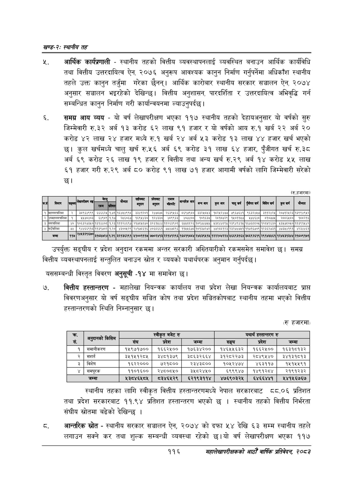

# Page 140 QA

## Rendered page


## Extracted text

```text
खण्ड-२स्थानीय तह
आर्थिक कार्यप्रणाली -स्थानीय तहको वित्तीय व्यवस्थापनलाई व्यवस्थित बनाउन आर्थिक कार्यविधि तथा वित्तीय उत्तरदायित्व ऐन, २०७६ अनुरूप आवश्यक कानुन निर्माण गर्नुपर्नेमा अधिकाँश स्थानीय तहले उक्त कानुन तर्जुमा गरेका छैनन्‌। आर्थिक कारोबार स्थानीय सरकार सञ्चालन ऐन, २०७४ अनुसार सञ्चालन भइरहेको देखिन्छ। वित्तीय अनुशासन, पारदर्शिता र उत्तरदायित्व अभिवृद्धि गर्न सम्बन्धित कानुन निर्माण गरी कार्यान्वयनमा ल्याउनुपर्दछ।
समग्र आय व्यय -यो वर्ष लेखापरीक्षण भएका ११७ स्थानीय तहको देहायअनुसार यो वर्षको सुरु जिम्मेवारी रु.३२ अर्ब १३ करोड ६२ लाख ९१ हजार र यो वर्षको आय रु.१ खर्ब २२ अर्ब २० करोड ४२ लाख २४ हजार मध्ये रु.१ खर्ब २४ अर्ब ५३ करोड १३ लाख ४४ हजार खर्च भएको छ। कुल खर्चमध्ये चालु खर्च रु.५६ अर्ब ६९ करोड ३१ लाख ६४ हजार, पुँजीगत खर्च रु.३८ अर्ब ६९ करोड २६ लाख १९ हजार र वित्तीय तथा अन्य खर्च रु.२९ अर्ब १४ करोड ५४५ लाख ६१ हजार गरी रु.२९ अर्ब ८० करोड ९१ लाख ७१ हजार आगामी वर्षको लागि जिम्मेवारी सरेको छ।
(रु.हजारमा)
उपर्युक्त सङ्घीय र प्रदेश अनुदान रकममा अन्तर सरकारी अख्तियारीको रकमसमेत समावेश छ। समग्र वित्तीय व्यवस्थापनलाई सन्तुलित बनाउन स्रोत र व्ययको यथार्थपरक अनुमान गर्नुपर्दछ |
यससम्बन्धी विस्तृत विवरण अनुसूची -१४ मा समावेश छ।
वित्तीय हस्तान्तरण -महालेखा नियन्त्रक कार्यालय तथा प्रदेश लेखा नियन्त्रक कार्यालयबाट प्राप्त विवरणअनुसार यो वर्ष सङ्घीय सञ्चित कोष तथा प्रदेश सञ्चितकोषबाट स्थानीय तहमा भएको वित्तीय हस्तान्तरणको स्थिति निम्नानुसार छ।
(र हजारमा)
स्थानीय तहका लागि स्वीकृत वित्तीय हस्तान्तरणमध्ये नेपाल सरकारबाट ८८.०६ प्रतिशत तथा प्रदेश सरकारबाट ११.९४ प्रतिशत हस्तान्तरण भएको छ। स्थानीय तहको वित्तीय निर्भरता संघीय स्रोतमा बढेको देखिन्छ।
ट. आन्तरिक स्रोत -स्थानीय सरकार सञ्चालन ऐन, २०७४ को दफा ५४ देखि ६३ सम्म स्थानीय तहले लगाउन सक्ने कर तथा शुल्क सम्बन्धी व्यवस्था रहेको छ। यो वर्ष लेखापरीक्षण भएका ११७
११६
सहालेखापरीक्षकको आठौँ वाषिकि प्रतिवेदन २०८२

| कत | नियत | सस्ग्या | लेखापरीक्षण गढ | बेल |  | बन | नुर | प्रदेशबाट | राजस्व बाँडफाँट |  |  | कुसबाप | चालु खर्ष | पुँबीगत खर्ष |  |  |  |
| --- | --- | --- | --- | --- | --- | --- | --- | --- | --- | --- | --- | --- | --- | --- | --- | --- | --- |
| १ | महानगरपालिका | २ | ३८९६४९९९ | ६६६६२१ | १७१ | १६४१४९९८ | ३३४१२०१ | २४७०७८ | २६३९४६६ | ८६९७९६८० | ३३२५८१३ | १८२४२४७७ | ७९६७६४१ | ९६३२४४७ | ३११२४२५ | २०७१२१२३ | १३९९४९१२ |
| २ |  | पै | १४७०४०३ | ६४९८९ | ११७ | २१६०६७ | १६९५४३० | १२४३३० | ४८९९३३ | ४०७४०० | १०१६३४ | २८१८७२९ | १४०११५७ | २७४४४८ | ८१०७७५ | २०८६४८० | १८८२१६ |
|  |  |  | १०६३२७३४० | ३१४० | २३ | १११२४३९७ | ७३० |  | १ | बकर | ०९७७ |  | २३४९ ११ | प७३०००४ | तर८९३३०, | अ३४७००७० |  |
| ४ | गाउँपालिका | ७४ | ९४४६६९१८ | ११३९७०२ | १.२० | ४३००४२९ | २४१७८६१६ | ४०६८६६१ | ७३/७८९६ | ११४५६७८ | १०१३७२७२ | ४७२८८१२३ | २३२७४७४१ | ११७१६७०९ | १२३६२७३१ | ४७३४४१९१ | ४२३४४ई१ |
|  | बम्मा | ११५ | ररर ६७० | ३१०४७२४ | १.२९ | ३२१३६२९१ | ५१००१११७ | ७७०२४१३ | २२१४१२९६ | १६८१९८८४ | २४१३९४५१५ | १२२२०४२२४ | १६६९३१४४ | ३८६९२६१९ | २९१४४५६१ | १२४४३१३४४ | २९८०९१७१ |

| क्र |  |  | स्वीकृत बजेट |  |  | यथार्थ हस्तान्तरण | रु |
| --- | --- | --- | --- | --- | --- | --- | --- |
| रु |  | संघ | प्रदेश | जम्मा | सङ्घ | प्रदेश | जम्मा |
| १ | समाचीकरण | १५९७१७०० | १६६२५०० | १७६३४२०० | १४६५५६३२ | १६६२५०० | १६३१८१३२ |
| २ | सञशर्त | ३४५१५१२८५ | ३४८१३७९ | ३८६३२६६४ | ३१२८२२७३ | २८४९५४० | ३४१३१८१३ |
| ३ | विशेष | १६२२००० | ७२१८०० | २३४३८०० | १०१२४७४ | ४६३११७ | १५१५५९१ |
| ४ | समपूरक | ११०१६०० | २४८०८५० | उ३४८२४५० | ६९९९४७ | १४९१२८४ | २१९१२३२ |
|  | जम्मा | ५३०४६५८५ | ०८३४६५२९ | ६२१९३११४ | ४७६९०३२५ | ६४६६४४१ | २४१५६७६७ |
```

## Flags
- table_page
- medium_quality_table
