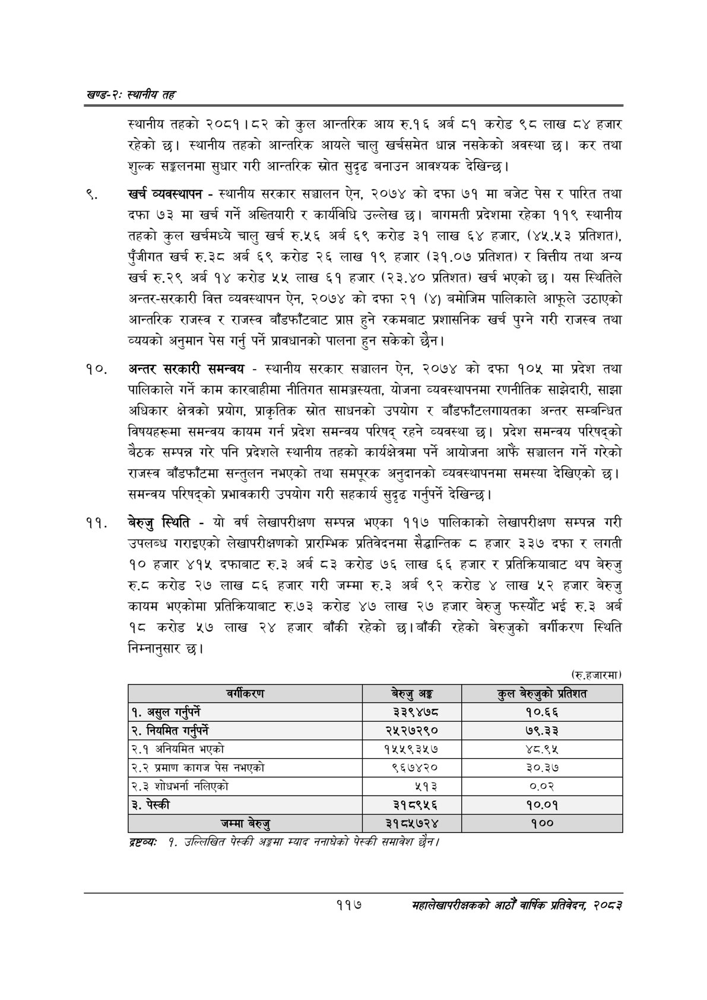

# Page 141 QA

## Rendered page


## Extracted text

```text
खण्ड-२स्थानीय तह
स्थानीय तहको २०८१।८२ को कुल आन्तरिक आय रु.१६ अर्ब ८१ करोड ९८ लाख ८४ हजार रहेको छ। स्थानीय तहको आन्तरिक आयले चालु खर्चसमेत धान्न नसकेको अवस्था | कर तथा शुल्क सङ्कलनमा सुधार गरी आन्तरिक स्रोत सुदृढ बनाउन आवश्यक देखिन्छ।
खर्च व्यवस्थापन -स्थानीय सरकार सञ्चालन ऐन, २०७४ को दफा ७१ मा बजेट पेस र पारित तथा दफा ७३ मा खर्च गर्ने अख्तियारी र कार्यविधि उल्लेख छु। बागमती प्रदेशमा रहेका ११९ स्थानीय तहको कुल खर्चमध्ये चालु खर्च रु.५६ अर्ब ६९ करोड ३१ लाख ६४ हजार, (४५.५३ प्रतिशत), पुँजीगत खर्च रु.३८ अर्ब ६९ करोड २६ लाख १९ हजार (३१,०७ प्रतिशत) र वित्तीय तथा अन्य खर्च रु.२९ अर्ब १४ करोड ५५ लाख ६१ हजार (२३.४० प्रतिशत) खर्च भएको छ। यस स्थितिले अन्तर-सरकारी वित्त व्यवस्थापन ऐन, २०७४ को दफा २१ (४) बमोजिम पालिकाले आफूले उठाएको आन्तरिक राजस्व र राजस्व बाँडफाँटबाट प्राप्त हुने रकमबाट प्रशासनिक खर्च पुग्ने गरी राजस्व तथा व्ययको अनुमान पेस गर्नु पर्ने प्रावधानको पालना हुन सकेको छैन।
अन्तर सरकारी समन्वय -स्थानीय सरकार सञ्चालन ऐन, २०७४ को दफा १०५ मा प्रदेश तथा पालिकाले गर्ने काम कारबाहीमा नीतिगत सामञ्जस्यता, योजना व्यवस्थापनमा रणनीतिक साझेदारी, साझा अधिकार क्षेत्रको प्रयोग, प्राकृतिक स्रोत साधनको उपयोग र बाँडफाँटलगायतका अन्तर सम्बन्धित विषयहरूमा समन्वय कायम गर्न प्रदेश समन्वय परिषद्‌ रहने व्यवस्था छ। प्रदेश समन्वय परिषद्को बैठक सम्पन्न गरे पनि प्रदेशले स्थानीय तहको कार्यक्षेत्रमा पर्ने आयोजना आफैं सञ्चालन गर्ने गरेको राजस्व बाँडफाँटमा सन्तुलन नभएको तथा समपूरक अनुदानको व्यवस्थापनमा समस्या देखिएको छ। समन्वय परिषद्को प्रभावकारी उपयोग गरी सहकार्य सुदृढ गर्नुपर्ने देखिन्छ |
बेरुजु स्थिति -यो वर्ष लेखापरीक्षण सम्पन्न भएका ११७ पालिकाको लेखापरीक्षण सम्पन्न गरी उपलब्ध गराइएको लेखापरीक्षणको प्रारम्भिक प्रतिवेदनमा सैद्धान्तिक ८ हजार ३३७ दफा र लगती १० हजार ४१५ दफाबाट रु.३ अर्ब ८३ करोड ७६ लाख ६६ हजार र प्रतिक्रियाबाट थप बेरुजु रु.८ करोड २७ लाख ८६ हजार गरी जम्मा रु.३ अर्ब ९२ करोड लाख ५२ हजार बेरुजु कायम भएकोमा प्रतिक्रियाबाट रु.७३ करोड ४७ लाख २७ हजार बेरुजु फस्यौट भई रु.३ अर्ब १८ करोड ५२७ लाख २४ हजार बाँकी रहेको छ। बाँकी रहेको बेरुजुको वर्गीकरण स्थिति निम्नानुसार छ।
द्रष्टव्यः १. उल्लिखित पेस्की अङ्कमा स्याद ननाघेको पेस्की समावेश /
११७
सहालेखापरीक्षकको आठौँ वाषिकि प्रतिवेदन २०८२

| बर्ीकिएण | बेरुजु अङ्ग | कुल न९शुको प्रतिशत |
| --- | --- | --- |
| १. असुल गर्नुपर्ने | ३३९४७८ | १०.६६ |
| २. निषित गर्नुपर्ने | २५२७२९० | ७९.३३ |
| २.१ अनिधभित भएको | १५५९३५७ | ४८.९५ |
| २.२ प्रमाण कागज पेस नभएको | ९६७४२० | ३०.३७ |
| २.३ शोधभर्ना नलिएको | ५१३ | ०.०२ |
| ३. पेस्की | ३१८९५६ | १०.०१ |
| जम्मा बेरुउ | ३१८५७२४ | १०० |
```

## Flags
- table_page
- medium_quality_table
