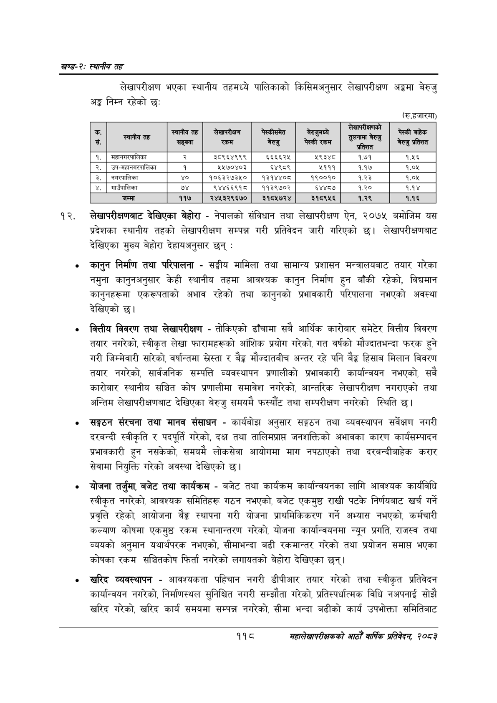

# Page 142 QA

## Rendered page


## Extracted text

```text
खण्ड-२स्थानीय तह
लेखापरीक्षण भएका स्थानीय तहमध्ये पालिकाको किसिमअनुसार लेखापरीक्षण अङ्गमा बेरुजु अङ्ग निम्न रहेको छ:
(रु.हजारमा)
लेखापरीक्षणबाट देखिएका बेहोरा -नेपालको संविधान तथा लेखापरीक्षण ऐन, २०७५ बमोजिम यस प्रदेशका स्थानीय तहको लेखापरीक्षण सम्पन्न गरी प्रतिवेदन जारी गरिएको छ। लेखापरीक्षणबाट देखिएका मुख्य बेहोरा देहायअनुसार छन्‌:
कानुन निर्माण तथा परिपालना -सङ्घीय मामिला तथा सामान्य प्रशासन मन्त्रालयबाट तयार गरेका नमुना कानुनअनुसार केही स्थानीय तहमा आवश्यक कानुन निर्माण हुन बाँकी रहेको, विद्यमान कानुनहरूमा एकरूपताको अभाव रहेको तथा कानुनको प्रभावकारी परिपालना नभएको अवस्था देखिएको छ।
वित्तीय विवरण तथा लेखापरीक्षण -तोकिएको ढाँचामा सबै आर्थिक कारोबार समेटेर वित्तीय विवरण तयार नगरेको, स्वीकृत लेखा फारामहरूको आंशिक प्रयोग गरेको, गत वर्षको मौज्दातभन्दा फरक हुने गरी जिम्मेवारी सारेको, वर्षान्तमा स्रेस्ता र ९% मौज्दातबीच अन्तर रहे पनि बेङ्ग हिसाब मिलान विवरण तयार नगरेको, सार्वजनिक सम्पत्ति व्यवस्थापन प्रणालीको प्रभावकारी कार्यान्वयन नभएको, सबै कारोबार स्थानीय सञ्चित कोष प्रणालीमा समावेश नगरेको, आन्तरिक लेखापरीक्षण नगराएको तथा अन्तिम लेखापरीक्षणबाट देखिएका बेरुजु समयमै फस्यौट तथा सम्परीक्षण नगरेको स्थिति छ।
सङ्गठन संरचना तथा मानव संसाधन -कार्यबोझ अनुसार सङ्गठन तथा व्यवस्थापन सर्वेक्षण नगरी दरबन्दी स्वीकृति र पदपूर्ति गरेको, दक्ष तथा तालिमप्राप जनशक्तिको अभावका कारण कार्यसम्पादन प्रभावकारी हुन नसकेको, समयमै लोकसेवा आयोगमा माग नपठाएको तथा दरबन्दीबाहेक करार सेवामा नियुक्ति गरेको अवस्था देखिएको छ।
योजना तर्जुमा, बजेट तथा कार्यक्रम -बजेट तथा कार्यक्रम कार्यान्वयनका लागि आवश्यक कार्यविधि स्वीकृत नगरेको, आवश्यक समितिहरू गठन नभएको, बजेट एकमुष्ठ राखी पटके निर्णयबाट खर्च गर्ने प्रवृत्ति रहेको, आयोजना बेङ्ग स्थापना गरी योजना प्राथमिकिकरण गर्ने अभ्यास नभएको, कर्मचारी कल्याण कोषमा एकमुष्ठ रकम स्थानान्तरण गरेको, योजना कार्यान्वयनमा न्यून प्रगति, राजस्व तथा व्ययको अनुमान यथार्थपरक नभएको, सीमाभन्दा बढी रकमान्तर गरेको तथा प्रयोजन समाप्त भएका कोषका रकम सञ्चितकोष फिर्ता नगरेको लगायतको बेहोरा देखिएका छन्‌।
खरिद व्यवस्थापन -आवश्यकता पहिचान नगरी डीपीआर तयार गरेको तथा स्वीकृत प्रतिवेदन कार्यान्वयन नगरेको, निर्माणस्थल सुनिश्चित नगरी सम्झौता गरेको, प्रतिस्पर्धात्मक विधि नअपनाई सोझै खरिद गरेको, खरिद कार्य समयमा सम्पन्न नगरेको, सीमा भन्दा बढीको कार्य उपभोक्ता समितिबाट
११८
सहालेखापरीक्षकको आठौँ वाषिकि प्रतिवेदन २०८२

| क. सं. |  | स्थानीय हत सङ्ख्या | लेखापरीकण 'रकम | अल्कोसमेत बेरुजु | जर्जुभन्ये पेस्की रकम | ठन्छादिङा प्रतिशत | पेस्की बाहेक बेरुजु प्रतिशत |
| --- | --- | --- | --- | --- | --- | --- | --- |
| १ | महानमरबालिका | र | ३८९६४९९९ | ६६६६२५ | ५९३४८ | १.७१ | १.५६ |
| २ | उप-नहानमरपालिका | १ | ५५७०४०३ | ६४९८९ | ५१११ | १.१७ | १.०४५ |
| ३ | नगस्यालिका | ४० | १०६३२७३५० | १३१४४०८ | १९००१० | १.२३ | १.०४५ |
| ४ | नाउँपालिका | ७४ | ९४४६६९१८ | ११३९७०२ | ६४४८७ | १.२० | १.१४ |
| ५ | जम्मा | ११७ | २४५३२९६७० | ३१८५७२४ | ३१८९५६ | १.२९ | १.१६ |
```

## Flags
- table_page
- medium_quality_table
