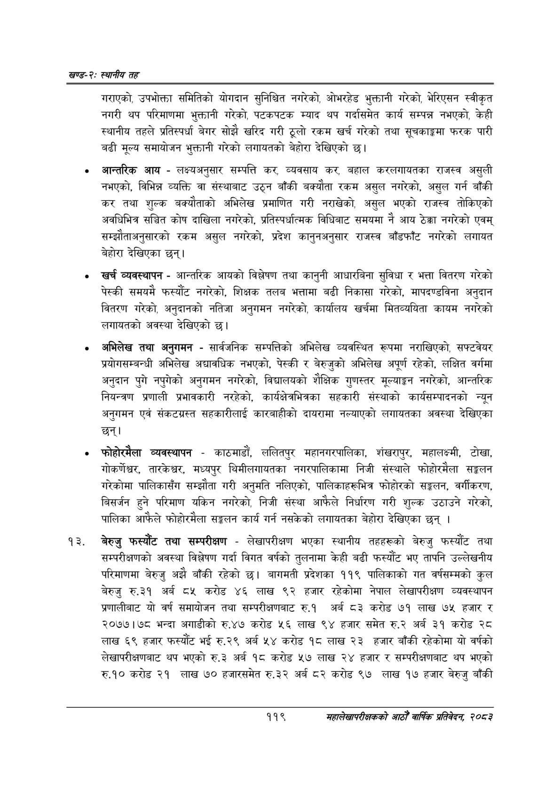

# Page 143 QA

## Rendered page


## Extracted text

```text
खण्ड-२स्थानीय तह
गराएको, उपभोक्ता समितिको योगदान सुनिश्चित नगरेको, ओभरहेड भुक्तानी गरेको, भेरिएसन स्वीकृत नगरी थप परिमाणमा भुक्तानी गरेको, पटकपटक म्याद थप गर्दासमेत कार्य सम्पन्न नभएको, केही स्थानीय तहले प्रतिस्पर्धा बेगर सोझै खरिद गरी ठूलो रकम खर्च गरेको तथा सूचकाङ्कमा फरक पारी बढी मूल्य समायोजन भुक्तानी गरेको लगायतको बेहोरा देखिएको छ।
आन्तरिक आय -लक्ष्यअनुसार सम्पत्ति कर, व्यवसाय कर, बहाल करलगायतका राजस्व असुली नभएको, विभिन्न व्यक्ति वा संस्थाबाट उठ्न बाँकी बक्यौता रकम असुल नगरेको, असुल गर्न बाँकी कर तथा शुल्क बक्यौताको अभिलेख प्रमाणित गरी नराखेको, असुल भएको राजस्व तोकिएको अवधिभित्र सञ्चित कोष दाखिला नगरेको, प्रतिस्पर्धात्मक विधिबाट समयमा नै आय ठेक्का नगरेको एवम्‌ सम्झौताअनुसारको रकम असुल नगरेको, प्रदेश कानुनअनुसार राजस्व बाँडफाँट नगरेको लगायत बेहोरा देखिएका छन्‌।
खर्च व्यवस्थापन -आन्तरिक आयको विश्लेषण तथा कानुनी आधारबिना सुविधा र भत्ता वितरण गरेको पेस्की समयमै फस्यौट नगरेको, शिक्षक तलब भत्तामा बढी निकासा गरेको, मापदण्डविना अनुदान वितरण गरेको, अनुदानको नतिजा अनुगमन नगरेको, कार्यालय खर्चमा मितव्ययिता कायम नगरेको लगायतको अवस्था देखिएको छ।
अभिलेख तथा अनुगमन -सार्वजनिक सम्पत्तिको अभिलेख व्यवस्थित रूपमा नराखिएको, सफ्टवेयर प्रयोगसम्बन्धी अभिलेख अद्यावधिक नभएको, पेस्की र बेरुजुको अभिलेख अपूर्ण रहेको, लक्षित वर्गमा अनुदान पुगे नपुगेको अनुगमन नगरेको, विद्यालयको शैक्षिक गुणस्तर मूल्याङ्कन नगरेको, आन्तरिक नियन्त्रण प्रणाली प्रभावकारी नरहेको, कार्यक्षेत्रभित्रका सहकारी संस्थाको कार्यसम्पादनको न्यून अनुगमन एवं संकटग्रस्त सहकारीलाई कारबाहीको दायरामा नल्याएको लगायतका अवस्था देखिएका छन्‌।
फोहोरमैला व्यवस्थापन -काठमाडौं, ललितपुर महानगरपालिका, शंखरापुर, महालक्ष्मी, टोखा, गोकर्णेघ्वर, तारकेश्वर, मध्यपुर थिमीलगायतका नगरपालिकामा निजी संस्थाले फोहोरमैला सङ्कलन गरेकोमा पालिकासँग सम्झौता गरी अनुमति नलिएको, पालिकाहरूभित्र फोहोरको सङ्कलन, वर्गीकरण, बिसर्जन हुने परिमाण यकिन नगरेको, निजी संस्था आफैले निर्धारण गरी शुल्क उठाउने गरेको, पालिका आफैले फोहोरमैला सङ्कलन कार्य गर्न नसकेको लगायतका बेहोरा देखिएका छन्‌ |
बेरुजु फस्यौट तथा सम्परीक्षण -लेखापरीक्षण भएका स्थानीय तहहरूको बेरुजु फरस्यौट तथा सम्परीक्षणको अवस्था विश्लेषण गर्दा विगत वर्षको तुलनामा केही बढी फस्यौट भए तापनि उल्लेखनीय परिमाणमा बेरुजु अझै बाँकी रहेको छ। बागमती प्रदेशका ११९ पालिकाको गत वर्षसम्मको कुल बेरुजु रु.३१ अर्ब ८५ करोड ४६ लाख ९२ हजार रहेकोमा नेपाल लेखापरीक्षण व्यवस्थापन प्रणालीबाट यो वर्ष समायोजन तथा सम्परीक्षणबाट रु.१ अर्ब ८३ करोड ७१ लाख ७५ हजार र २०७७।७८ भन्दा अगाडीको रु.४७ करोड ५६ लाख ९४ हजार समेत रु.२ अर्ब ३१ करोड २८ लाख ६९ हजार फस्यौट भई रु.२९ अर्ब करोड १८ लाख २३ हजार बाँकी रहेकोमा यो वर्षको लेखापरीक्षणबाट थप भएको रु.३ अर्ब १८ करोड ५२७ लाख २४ हजार र सम्परीक्षणबाट थप भएको रु.१० करोड २१ लाख ७० हजारसमेत रु.३२ अर्ब ८२ करोड ९७ लाख १७ हजार बेरुजु बाँकी
११९
सहालेखापरीक्षकको आठौँ वाषिकि प्रतिवेदन २०८२
```

## Flags
- None
