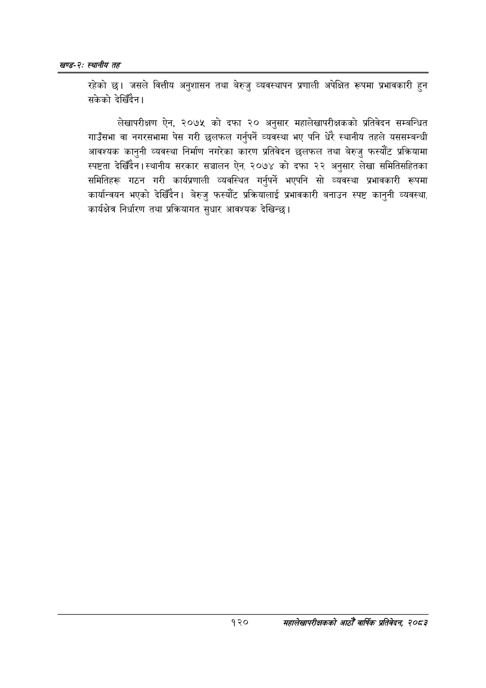

# Page 144 QA

## Rendered page


## Extracted text

```text
खण्ड-२स्थानीय तह
रहेको छ। जसले वित्तीय अनुशासन तथा बेरुजु व्यवस्थापन प्रणाली अपेक्षित रूपमा प्रभावकारी हुन सकेको देखिँदैन।
लेखापरीक्षण ऐन, २०७५ को दफा २० अनुसार महालेखापरीक्षकको प्रतिवेदन सम्बन्धित गाउँसभा वा नगरसभामा पेस गरी छलफल गर्नुपर्ने व्यवस्था भए पनि धेरै स्थानीय तहले यससम्बन्धी आवश्यक कानुनी व्यवस्था निर्माण नगरेका कारण प्रतिवेदन छलफल तथा बेरुजु फस्यौट प्रक्रियामा स्पष्टता देखिँदैन। स्थानीय सरकार सञ्चालन ऐन, २०७४ को दफा २२ अनुसार लेखा समितिसहितका समितिहरू गठन गरी कार्यप्रणाली व्यवस्थित गर्नुपर्ने भएपनि सो व्यवस्था प्रभावकारी रूपमा कार्यान्वयन भएको देखिँदैन। बेरुजु फस्यौट प्रक्रियालाई प्रभावकारी बनाउन स्पष्ट कानुनी व्यवस्था, कार्यक्षेत्र निर्धारण तथा प्रक्रियागत सुधार आवश्यक देखिन्छ।
१२०
सहालेखापरीक्षकको आठौँ वाषिकि प्रतिवेदन २०८२
```

## Flags
- None
