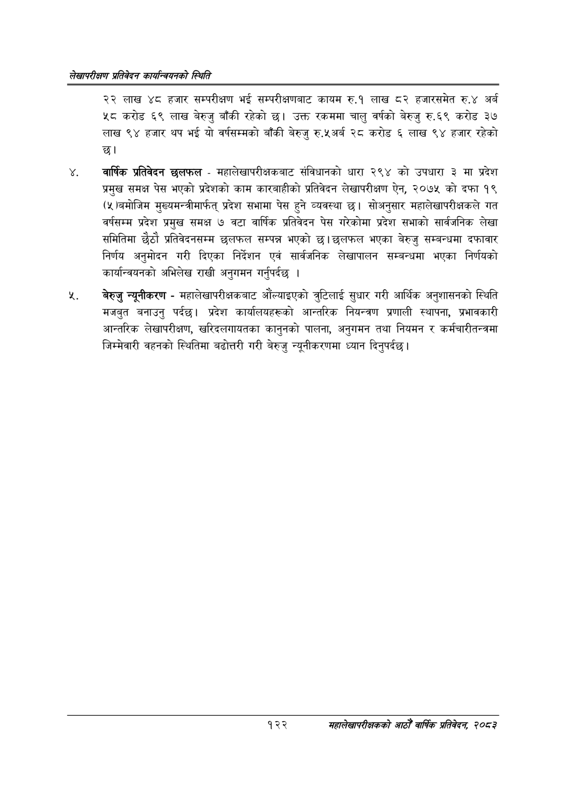

# Page 148 QA

## Rendered page


## Extracted text

```text
लेखापरीक्षण प्रतिवेदन का्यन्वियनको स्थिति
२२ लाख ४८ हजार सम्परीक्षण भई सम्परीक्षणबाट कायम रु.१ लाख ८२ हजारसमेत रु.४ अर्ब ५८ करोड ६९ लाख बेरुजु बाँकी रहेको उक्त रकममा चालु वर्षको बेरुजु रु.६९ करोड ३७ लाख ९४ हजार थप भई यो वर्षसम्मको बाँकी बेरुजु रु.५अर्ब २८ करोड ६ लाख ९४ हजार रहेको छ।
वार्षिक प्रतिविदन छलफल -महालेखापरीक्षकबाट संविधानको धारा २९४ को उपधारा ३ मा प्रदेश प्रमुख समक्ष पेस भएको प्रदेशको काम कारबाहीको प्रतिवेदन लेखापरीक्षण ऐन, २०७५ को दफा १९ (५)बमोजिम मुख्यमन्त्रीमार्फत्‌ प्रदेश सभामा पेस हुने व्यवस्था छ। सोअनुसार महालेखापरीक्षकले गत वर्षसम्म प्रदेश प्रमुख समक्ष ७ वटा वार्षिक प्रतिवेदन पेस गरेकोमा प्रदेश सभाको सार्वजनिक लेखा समितिमा छैठौ प्रतिवेदनसम्म छलफल सम्पन्न भएको | छलफल भएका बेरुजु सम्बन्धमा दफावार निर्णय अनुमोदन गरी दिएका निर्देशन एवं सार्वजनिक लेखापालन सम्बन्धमा भएका निर्णयको कार्यान्वयनको अभिलेख राखी अनुगमन गर्नुपर्दछ।
बेरुजु न्यूनीकरण -महालेखापरीक्षकबाट औंल्याइएको त्रुटिलाई सुधार गरी आर्थिक अनुशासनको स्थिति मजबुत बनाउनु पर्दछ। प्रदेश कार्यालयहरूको आन्तरिक नियन्त्रण प्रणाली स्थापना, प्रभावकारी आन्तरिक लेखापरीक्षण, खरिदलगायतका कानुनको पालना, अनुगमन तथा नियमन र कर्मचारीतन्त्रमा जिम्मेवारी वहनको स्थितिमा बढोत्तरी गरी बेरुजु न्यूनीकरणमा ध्यान दिनुपर्दछ |
१२२
सहालेखापरीक्षकको आठौँ वाषिकि प्रतिवेदन २०८२
```

## Flags
- None
