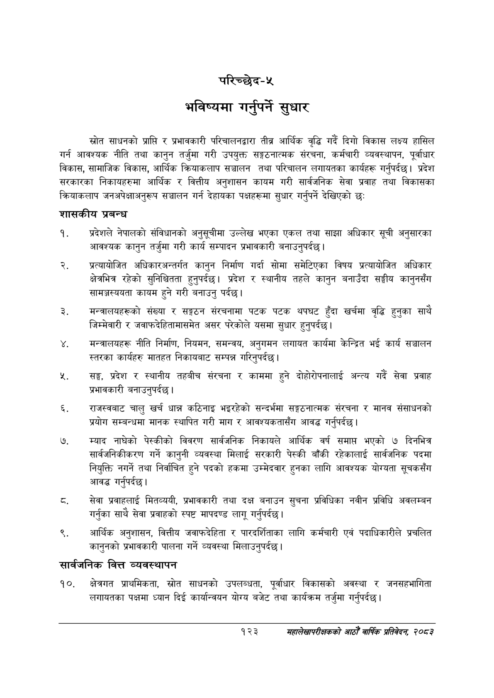

# Page 151 QA

## Rendered page


## Extracted text

```text
परिच्छेद-५
भविष्यमा गर्नुपर्ने सुधार
स्रोत साधनको प्राप्ति र प्रभावकारी परिचालनद्वारा तीव्र आर्थिक वृद्धि गर्दै दिगो विकास लक्ष्य हासिल गर्न आवश्यक नीति तथा कानुन तर्जुमा गरी उपयुक्त सङ्गठनात्मक संरचना, कर्मचारी व्यवस्थापन, पूर्वाधार विकास, सामाजिक विकास, आर्थिक क्रियाकलाप सञ्चालन तथा परिचालन लगायतका कार्यहरू गर्नुपर्दछ। प्रदेश सरकारका निकायहरुमा आर्थिक र वित्तीय अनुशासन कायम गरी सार्वजनिक सेवा प्रवाह तथा विकासका क्रियाकलाप जनअपेक्षाअनुरूप सञ्चालन गर्न देहायका पक्षहरूमा सुधार गर्नुपर्ने देखिएको छ:
शासकीय प्रबन्ध
प्रदेशले नेपालको संविधानको अनुसूचीमा उल्लेख भएका एकल तथा साझा अधिकार सूची अनुसारका आवश्यक कानुन तर्जुमा गरी कार्य सम्पादन प्रभावकारी बनाउनुपर्दछ |
प्रत्यायोजित अधिकारअन्तर्गत कानुन निर्माण गर्दा सोमा समेटिएका विषय प्रत्यायोजित अधिकार क्षेत्रभित्र रहेको सुनिश्चितता हुनुपर्दछ। प्रदेश र स्थानीय तहले कानुन बनाउँदा सङ्घीय कानुनसँग सामञ्जस्ययता कायम हुने गरी बनाउनु पर्दछ।
मन्त्रालयहरूको संख्या र सङ्गठन संरचनामा पटक पटक थपघट हुँदा खर्चमा वृद्धि हुनुका साथै जिम्मेवारी र जवाफदेहितामासमेत असर परेकोले यसमा सुधार हुनुपर्दछ |
मन्त्रालयहरू नीति निर्माण, नियमन, समन्वय, अनुगमन लगायत कार्यमा केन्द्रित भई कार्य सञ्चालन स्तरका कार्यहरु मातहत निकायबाट सम्पन्न गरिनुपर्दछ।
सङ्घ, प्रदेश र स्थानीय तहबीच संरचना र काममा हुने दोहोरोपनालाई अन्त्य गर्दै सेवा प्रवाह प्रभावकारी बनाउनुपर्दछ |
राजस्वबाट चालु खर्च धान्न कठिनाइ भइरहेको सन्दर्भमा सङ्गठनात्मक संरचना र मानव संसाधनको प्रयोग सम्बन्धमा मानक स्थापित गरी माग र आवश्यकतासँग आवद्ध गर्नुपर्दछ |
म्याद नाघेको पेस्कीको विवरण सार्वजनिक निकायले आर्थिक वर्ष समाप्त भएको ७ दिनभित्र सार्वजनिकीकरण गर्ने कानुनी व्यवस्था मिलाई सरकारी पेस्की बाँकी रहेकालाई सार्वजनिक पदमा नियुक्ति नगर्ने तथा निर्वाचित हुने पदको हकमा उम्मेदवार हुनका लागि आवश्यक योग्यता सूचकसँग आवद्ध गर्नुपर्दछ।
सेवा प्रवाहलाई मितव्ययी, प्रभावकारी तथा दक्ष बनाउन सुचना प्रविधिका नवीन प्रविधि अवलम्बन गर्नुका साथै सेवा प्रवाहको स्पष्ट मापदण्ड लागू गर्नुपर्दछ |
आर्थिक अनुशासन, वित्तीय जवाफदेहिता र पारदर्शिताका लागि कर्मचारी एवं पदाधिकारीले प्रचलित कानुनको प्रभावकारी पालना गर्ने व्यवस्था मिलाउनुपर्दछ।
सार्वजनिक वित्त व्यवस्थापन
क्षेत्रगत प्राथमिकता, स्रोत साधनको उपलब्धता, पूर्वाधार विकासको अवस्था र जनसहभागिता लगायतका पक्षमा ध्यान दिई कार्यान्वयन योग्य बजेट तथा कार्यक्रम तर्जुमा गर्नुपर्दछ |
१२३
सहालेखापरीक्षकको आठौँ वाषिकि प्रतिवेदन २०८२
```

## Flags
- None
