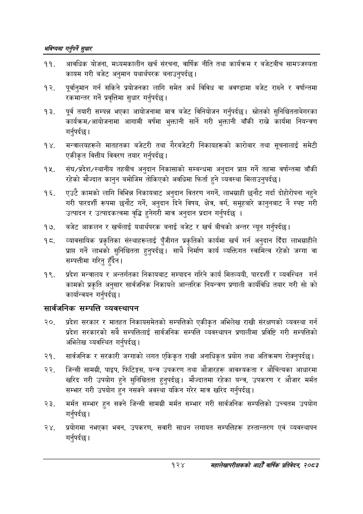

# Page 152 QA

## Rendered page


## Extracted text

```text
भविष्यमा गर्नुपर्ने सुक्षार
आवधिक योजना, मध्यमकालीन खर्च संरचना, वार्षिक नीति तथा कार्यक्रम र बजेटबीच सामञ्जस्यता कायम गरी बजेट अनुमान यथार्थपरक बनाउनुपर्दछ |
पूर्वानुमान गर्न सकिने प्रयोजनका लागि समेत अर्थ विविध वा अवण्डामा बजेट राख्ने र वर्षान्तमा रकमान्तर गर्ने प्रवृत्तिमा सुधार गर्नुपर्दछ |
पूर्व तयारी सम्पन्न भएका आयोजनामा मात्र बजेट विनियोजन गर्नुपर्दछ। स्रोतको सुनिश्चितताबेगरका कार्यक्रम/आयोजनामा आगामी वर्षमा भुक्तानी सार्ने गरी भुक्तानी बाँकी राख्ने कार्यमा नियन्त्रण गर्नुपर्दछ |
मन्त्रालयहरूले मातहतका बजेटरी तथा गैरबजेटरी निकायहरूको कारोबार तथा सूचनालाई समेटी एकीकृत वित्तीय विवरण तयार गर्नुपर्दछ |
संघ/प्रदेश/स्थानीय तहबीच अनुदान निकासाको सम्बन्धमा अनुदान प्राप्त गर्ने तहमा वर्षान्तमा बाँकी रहेको मौज्दात कानुन बमोजिम तोकिएको अवधिमा फिर्ता हुने व्यवस्था मिलाउनुपर्दछ।
एउटै कामको लागि विभिन्न निकायबाट अनुदान वितरण नगर्ने, लाभग्राही छनौट गर्दा दोहोरोपना नहुने गरी पारदर्शी रूपमा छनौट गर्ने, अनुदान दिने विषय, क्षेत्र, वर्ग, समूहबारे कानुनबाट नै स्पष्ट गरी उत्पादन र उत्पादकत्वमा वृद्धि हुनेगरी मात्र अनुदान प्रदान गर्नुपर्दछ।
बजेट आकलन र खर्चलाई यथार्थपरक बनाई बजेट र खर्च बीचको अन्तर न्यून गर्नुपर्दछ |
व्यावसायिक प्रकृतिका संस्थाहरूलाई पुँजीगत प्रकृतिको कार्यमा खर्च गर्न अनुदान दिँदा लाभग्राहीले प्राप्त गर्ने लाभको सुनिश्चितता हुनुपर्दछ। साथै निर्माण कार्य व्यक्तिगत स्वामित्व रहेको जग्गा वा सम्पत्तीमा गरिनु हुँदैन।
प्रदेश मन्त्रालय र अन्तर्गतका निकायबाट सम्पादन गरिने कार्य मितव्ययी, पारदर्शी र व्यवस्थित गर्न कामको प्रकृति अनुसार सार्वजनिक निकायले आन्तरिक नियन्त्रण प्रणाली कार्यविधि तयार गरी सो को कार्यान्वयन गर्नुपर्दछ |
सार्वजनिक सम्पत्ति व्यवस्थापन
प्रदेश सरकार र मातहत निकायसमेतको सम्पत्तिको एकीकृत अभिलेख राखी संरक्षणको व्यवस्था गर्न प्रदेश सरकारको सबै सम्पत्तिलाई सार्वजनिक सम्पत्ति व्यवस्थापन प्रणालीमा प्रविष्टि गरी सम्पत्तिको अभिलेख व्यवस्थित गर्नुपर्दछ |
सार्वजनिक र सरकारी जग्गाको लगत एकिकृत राखी अनाधिकृत प्रयोग तथा अतिक्रमण रोक्नुपर्दछ।
जिन्सी सामग्री, पाइप, फिटिङ्गस, यन्त्र उपकरण तथा औजारहरू आवश्यकता र औचित्यका आधारमा खरिद गरी उपयोग हुने सुनिश्चितता हुनुपर्दछ। मौज्दातमा रहेका यन्त्र, उपकरण र औजार मर्मत सम्भार गरी उपयोग हुन नसक्ने अवस्था यकिन गरेर मात्र खरिद गर्नुपर्दछ |
मर्मत सम्भार हुन सक्ने जिन्सी सामग्री मर्मत सम्भार गरी सार्वजनिक सम्पत्तिको उच्चतम उपयोग गर्नुपर्दछ |
२४, प्रयोगमा नभएका भवन, उपकरण, सवारी साधन लगायत सम्पत्तिहरू हस्तान्तरण एवं व्यवस्थापन गर्नुपर्दछ |
१२४
सहालेखापरीक्षकको आठौँ वाषिकि प्रतिवेदन २०८२
```

## Flags
- None
