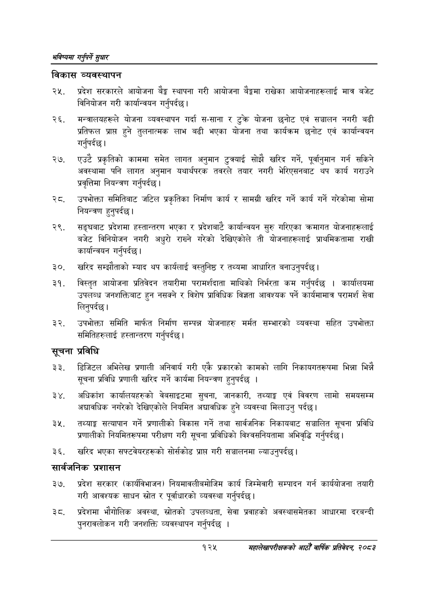

# Page 153 QA

## Rendered page


## Extracted text

```text
भविष्यमा गर्नुपर्ने सुक्षार
विकास व्यवस्थापन
प्रदेश सरकारले आयोजना बेङ्ग स्थापना गरी आयोजना बेङ्कमा राखेका आयोजनाहरूलाई मात्र बजेट विनियोजन गरी कार्यान्वयन गर्नुपर्दछ |
मन्त्रालयहरूले योजना व्यवस्थापन गर्दा स-साना र टुक्रे योजना छनोट एवं सञ्चालन नगरी बढी प्रतिफल प्राप्त हुने तुलनात्मक लाभ बढी भएका योजना तथा कार्यक्रम छनोट एवं कार्यान्वयन गर्नुपर्दछ |
एउटै प्रकृतिको काममा समेत लागत अनुमान टुत्र्याई सोझै खरिद गर्ने, पूर्वानुमान गर्न सकिने अवस्थामा पनि लागत अनुमान यथार्थपरक तवरले तयार नगरी भेरिएसनबाट थप कार्य गराउने प्रवृत्तिमा नियन्त्रण गर्नुपर्दछ |
उपभोक्ता समितिबाट जटिल प्रकृतिका निर्माण कार्य र सामग्री खरिद गर्ने कार्य गर्ने गरेकोमा सोमा नियन्त्रण हुनुपर्दछ।
सङ्घबाट प्रदेशमा हस्तान्तरण भएका र प्रदेशबाटै कार्यान्वयन सुरु गरिएका क्रमागत योजनाहरूलाई बजेट विनियोजन नगरी अधुरो राख्ने गरेको देखिएकोले ती योजनाहरूलाई प्राथमिकतामा राखी कार्यान्वयन गर्नुपर्दछ |
खरिद सम्झौताको म्याद थप कार्यलाई वस्तुनिष्ठ र तथ्यमा आधारित बनाउनुपर्दछ |
विस्तृत आयोजना प्रतिवेदन तयारीमा परामर्शदाता माथिको निर्भरता कम गर्नुपर्दछ। कार्यालयमा उपलब्ध जनशक्तिबाट हुन नसक्ने र विशेष प्राविधिक विज्ञता आवश्यक पर्ने कार्यमामात्र परामर्श सेवा लिनुपर्दछ |
उपभोक्ता समिति मार्फत निर्माण सम्पन्न योजनाहरु मर्मत सम्भारको व्यवस्था सहित उपभोक्ता समितिहरुलाई हस्तान्तरण गर्नुपर्दछ |
सूचना प्रविधि
डिजिटल अभिलेख प्रणाली अनिवार्य गरी एकै प्रकारको कामको लागि निकायगतरूपमा भिन्ना भिन्नै सूचना प्रविधि प्रणाली खरिद गर्ने कार्यमा नियन्त्रण हुनुपर्दछ।
अधिकांश कार्यालयहरुको वेबसाइटमा सुचना, जानकारी, तथ्याङ्क एवं विवरण लामो समयसम्म अद्यावधिक नगरेको देखिएकोले नियमित अद्यावधिक हुने व्यवस्था मिलाउनु पर्दछ।
तथ्याङ्क सत्यापान गर्ने प्रणालीको विकास गर्ने तथा सार्वजनिक निकायबाट सञ्चालित सूचना प्रविधि प्रणालीको नियमितरूपमा परीक्षण गरी सूचना प्रविधिको विश्वसनियतामा अभिवृद्धि गर्नुपर्दछ )
खरिद भएका सफ्टवेयरहरूको सोर्सकोड प्राप्त गरी सञ्चालनमा ल्याउनुपर्दछ।
सार्वजनिक प्रशासन
प्रदेश सरकार (कार्यविभाजन) नियमावलीबमोजिम कार्य जिम्मेवारी सम्पादन गर्न कार्ययोजना तयारी गरी आवश्यक साधन स्रोत र पूर्वाधारको व्यवस्था गर्नुपर्दछ |
प्रदेशमा भौगोलिक अवस्था, स्रोतको उपलब्धता, सेवा प्रवाहको अवस्थासमेतका आधारमा दरबन्दी पुनरावलोकन गरी जनशक्ति व्यवस्थापन गर्नुपर्दछ।
१२५
सहालेखापरीक्षकको आठौँ वाषिकि प्रतिवेदन २०८२
```

## Flags
- None
