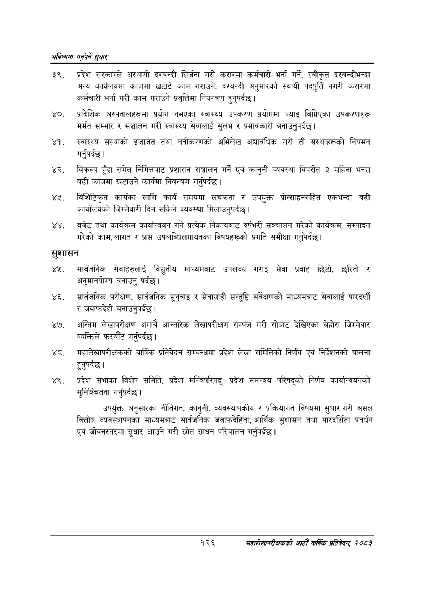

# Page 154 QA

## Rendered page


## Extracted text

```text
भविष्यमा गर्नुपर्ने सुक्षार
प्रदेश सरकारले अस्थायी दरबन्दी सिर्जना गरी करारमा कर्मचारी भर्ना गर्ने, स्वीकृत दरबन्दीभन्दा अन्य कार्यलयमा काजमा खटाई काम गराउने, दरबन्दी अनुसारको स्थायी पदपुर्ति नगरी करारमा कर्मचारी भर्ना गरी काम गराउने प्रवृत्तिमा नियन्त्रण हुनुपर्दछ |
प्रादेशिक अस्पतालहरूमा प्रयोग नभएका स्वास्थ्य उपकरण प्रयोगमा ल्याइ बिग्रिएका उपकरणहरू मर्मत सम्भार र सञ्चालन गरी स्वास्थ्य सेवालाई सुलभ र प्रभावकारी बनाउनुपर्दछ |
स्वास्थ्य संस्थाको इजाजत तथा नवीकरणको अभिलेख अद्यावधिक गरी ती संस्थाहरूको नियमन गर्नुपर्दछ |
विकल्प हुँदा समेत निमित्तबाट प्रशासन सञ्चालन गर्ने एवं कानुनी व्यवस्था विपरीत ३ महिना भन्दा बढी काजमा खटाउने कार्यमा नियन्त्रण गर्नुपर्दछ |
विशिष्टिकृत कार्यका लागि कार्य समयमा लचकता र उपयुक्त प्रोत्साहनसहित एकभन्दा बढी कार्यालयको जिम्मेवारी दिन सकिने व्यवस्था मिलाउनुपर्दछ।
बजेट तथा कार्यक्रम कार्यान्वयन गर्ने प्रत्येक निकायबाट वर्षभरी सञ्चालन गरेको कार्यक्रम, सम्पादन गरेको काम, लागत र प्राप्त उपलब्धिलगायतका विषयहरूको प्रगति समीक्षा गर्नुपर्दछ |
सुशासन
सार्वजनिक सेवाहरुलाई विद्युतीय माध्यमबाट उपलव्ध गराइ सेवा प्रवाह छिटो, छरितो र अनुमानयोग्य बनाउनु पर्दछ।
सार्वजनिक परीक्षण, सार्वजनिक सुनुवाइ र सेवाग्राही सन्तुष्टि सर्वेक्षणको माध्यमबाट सेवालाई पारदर्शी र जवाफदेही बनाउनुपर्दछ |
अन्तिम लेखापरीक्षण अगावै आन्तरिक लेखापरीक्षण सम्पन्न गरी सोबाट देखिएका बेहोरा जिम्मेवार व्यक्तिले फस्यौट गर्नुपर्दछ |
महालेखापरीक्षकको वार्षिक प्रतिवेदन सम्बन्धमा प्रदेश लेखा समितिको निर्णय एवं निर्देशनको पालना हुनुपर्दछ |
प्रदेश सभाका विशेष समिति, प्रदेश मन्त्रिपरिषद्‌, प्रदेश समन्वय परिषद्को निर्णय कार्यान्वयनको सुनिश्चितता गर्नुपर्दछ |
उपर्युक्त अनुसारका नीतिगत, कानुनी, व्यवस्थापकीय र प्रक्रियागत विषयमा सुधार गरी असल वित्तीय व्यवस्थापनका माध्यमबाट सार्वजनिक जवाफदेहिता, आर्थिक सुशासन तथा पारदर्शिता प्रवर्धन एवं जीवनस्तरमा सुधार आउने गरी स्रोत साधन परिचालन गर्नुपर्दछ |
१२६
सहालेखापरीक्षकको आठौँ वाषिकि प्रतिवेदन २०८२
```

## Flags
- None
