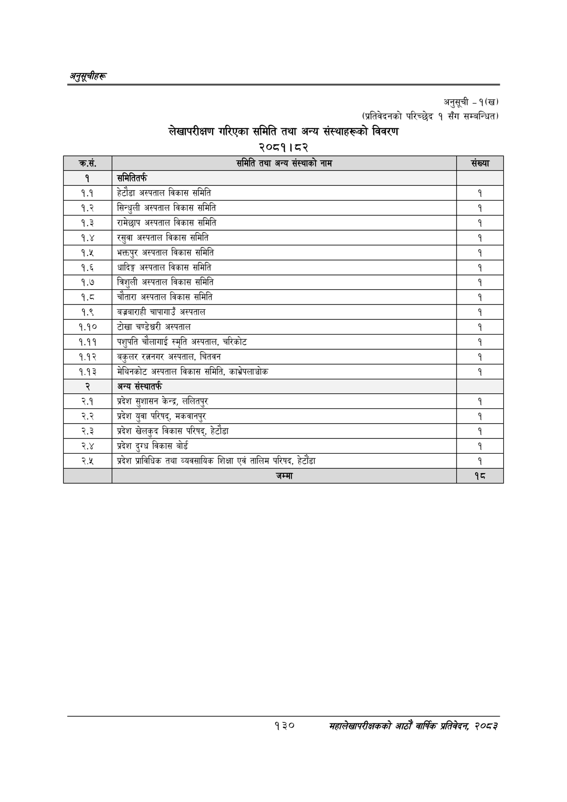

# Page 160 QA

## Rendered page


## Extracted text

```text
अनुतूचीहरू
अनुसूची
-१(ख)
(प्रतिवेदनको परिच्छेद १ सँग सम्बन्धित)
लेखापरीक्षण गरिएका समिति तथा अन्य संस्थाहरूको विवरण
२०८१।८२
१३०
सहालेखापरीक्षकको वाषिकि प्रतिवेदन २०८२

| क्रस | समिति तथा अन्य संस्थाको नाम | संख्या |
| --- | --- | --- |
| १ | समितितक |  |
| १.१ | हेटौडा अस्पताल विकास समिति | १ |
| १.२ | सिन्धुली अस्पताल विकास समिति | १ |
| १.३ | रामेछाप अस्पताल विकास समिति | १ |
| १.४ | रसुवा अस्पताल विकास समिति | १ |
| ९.४ | भक्तपुर अस्पताल विकास समिति |  |
| १.६ | धादिङ्ग अस्पताल विकास समिति | १ |
| १.७ | त्रिशुली अस्पताल विकास समिति | १ |
| १.८ | चौतारा अस्पताल विकास समिति | १ |
| १.९ | बज्रबाराही चापागाउँ अस्पताल | १ |
| १.१० | टोखा चण्डेश्वरी अस्पताल |  |
| ९.९९ | पशुपति चौलागाई स्मृति अस्पताल, चरिकोट | १ |
| १.१२ | बकुलर रतनगर अस्पताल, चितवन | १ |
| १.१३ | मेबिनकोट अस्पताल विकास समिति, काभ्रेपलाञ्चोक | १ |
| २ | अन्य संस्थातर्फ |  |
| २.१ | प्रदेश सुशासन केन्द्र, ललितपुर | १ |
| २.२ | प्रदेश युवा परिषद्‌, मकवानपुर | १ |
| २.३ | प्रदेश खेलकुद बिकास परिषद्‌, हेटौडा | १ |
| २.४ | प्रदेश दुग्ध विकास वोर्ड | १ |
| २.५ | प्रदेश प्राविधिक तथा ०थवसाबिक शिक्षा एवं तालिम परिषद, हेटौंडा | १ |
|  | जम्मा | १८ |
```

## Flags
- table_page
- medium_quality_table
