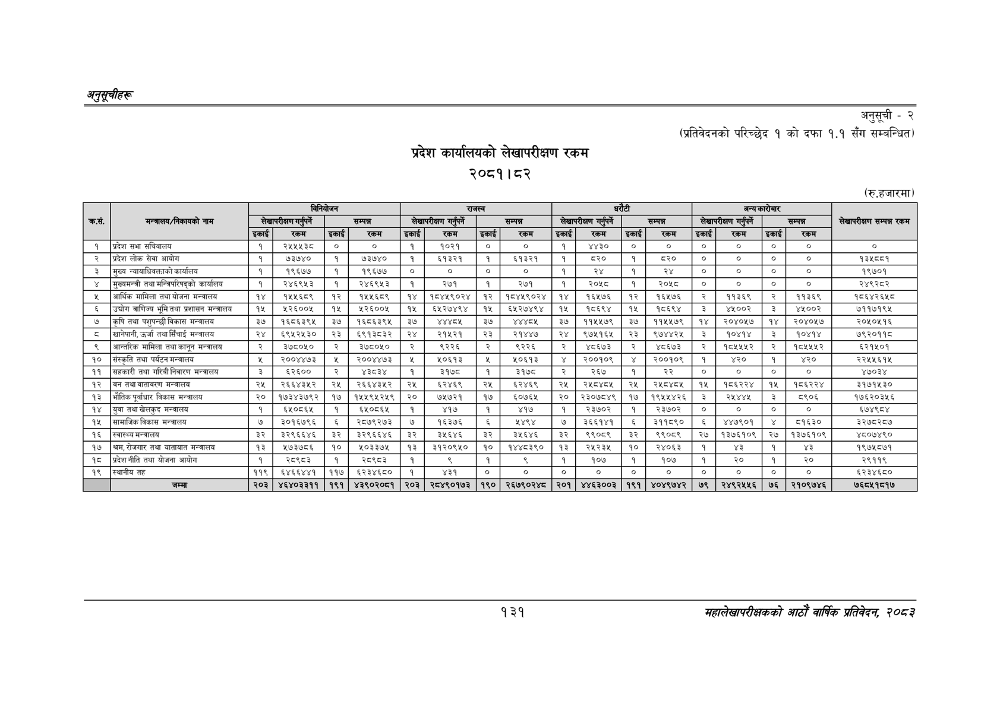

# Page 161 QA

## Rendered page


## Extracted text

```text
अनुतूचीहरू
प्रदेश कार्यालयको लेखापरीक्षण रकम
२०८१।८२
अनुसूची -२
(प्रतिवेदनको परिच्छेद १ को दफा १.१ सँग सम्बन्धित)
(रु.हजारमा)
१३१
सहालेखापरीक्षकको आठाँ वाषिकि प्रतिवेदन २०८२

|  |  |  |  | विनियोजन |  |  | राजस्व |  |  |  |  | धरोटी |  |  |  | अन्यकारोबार |  |  |
| --- | --- | --- | --- | --- | --- | --- | --- | --- | --- | --- | --- | --- | --- | --- | --- | --- | --- | --- |
| कस. | 'मन्तरालय/निकायको नाम |  | लेखापरीक्षण गर्पर्ने |  | सम्पन्न |  | लेखापरीक्षण गर्नपर्ने |  | सम्पन्न |  | लेखापरीक्षण गर्र्ने |  | सम्पन्न |  | लेखापरीक्षण गर्नपर्ने |  | सम्पन्न | लेखापरीक्षण सम्पन्न रकम |
|  |  | इकाई | रकम | इकाई | रकम | इकाई | रकम | इकाई | रकम | इकाई | रकम | इकाई | रकम | इकाई | रकम | इकाई | रकम |  |
| १ | प्रदेश सभा सचिवालय | १ | र२१५५३७० | ० | ० | १ | १०२१ | ० | ० | १ | ४४३० | ० | ० | ० | ० | ० | ०. | ० |
| २ | प्रदेश लोक सेवा आयोग | १ | ७३७४० | १ | ७३७४० | १ | ब१३२१ | १ | ६१३२१ | १ | ८२० | १ | ५२० | ० | ० | ० | ० | १३५४८८१ |
| ३ | मुख्य न्यायाधिकक्ताको कार्यालय | १ | १९६७७ | १ | १९६७७ |  | ० | ० | ० | १ | २४ | १ | २४ | ० | ० |  | ० | १९७०१ |
| ४ | मुख्यमन्त्री तथा मन्त्रिपरिषद्को कार्यालय | १ | २४६९४५३ | १ | र२४६९४३ | १ | २७१ | व्‌ | २७१ | १ |  | १ | र०५४८ | ० | ० |  | ० | २४९२८२ |
| ५ | आर्थिक मामिला तथा योजना मन्त्रालय | क४ | ५६८९ | १२ | १४५५६८९ | १४ | १८४५९०२४ | १२ | बढ४५९०२४ | १४ | १६५७६ | १२ | १६४७६ | २ | १३६९ | २ | ११३६९ | १८६४२६४८ |
| ६ | उच्योग बाणिज्य भूमितया प्रशासन मन्तराय | १५ | ५२६००५ | ५ | २६००५ | १५ |  |  | इश२७४९४ | १५ | ८६९४ | १५ | बढ६इ९४ | इ | ४५००२ | इ | ४१००२ | ७११७१९५ |
| ७ | कृषि तथा पशुपन्छी विकास मन्चरालय | ३७ | १६८६३९५ | ३७ | १६८६३९५ | इ७ |  | इ७ | सरर | ३७ | ११४५७९ | ३ | ११४५७९ | १४ | २०४०४७ | १४ | २०४०५७ | २०५०५१६ |
| ५ | खानेपानी,उर्जा तथा सिँचाई मन्चालय | २४ | ६९५२५३० | २३ | ६९१३८३२ | २४ | र२१५२१ | २३ | र१४४७ | र४ट | ९७४१६५ | २३ | ९७४४२५ | ३ | ०४१४ | ३ | ०४१४ | ७९२०११८ |
| ९ | अआन्तरिक मामिला तथा कानून मन्त्रालय | २ | इ७८०४० | २ | इ३७८०४० | २ | ९२२६ | २। | ९२२६ | २ | ४८६७३ | २ | ४६७३ | २ | १८१४५२ | २ | १८५१४५२ | ६२१५०१ |
| १० | संस्कृति तथा पर्यटन मन्वालय |  | २००४४७३ | ४१ | र२े००४४७३ | ४ | ५०६१३ |  | %०५९३ |  | २००१०९ | ४ | २००१०९ | १ | ४२० | १ | ४२० | २२५५६१५ |
| ११ | सहकारी तथा गरिबी निवारण मन्त्रालय | ३ | ५२६०० | रे | ४ड्छइ४ | १ | ३१७८ | १ | ३१७८ | र | २६७ | १ | २२ | ० | ० | ० | ० | ४७०३४ |
| १२ | वन तथा वातावरण मन्त्रालय | २५ | २६६४३५२ | २५ | २६६४३५२ | २५ | दर | २४५ | ६२४६ | २४५ | र४८४८५ | २५ | र२४८४८५ | १५ | १८६२२४ | १५ | १८६२२४ | ३१७१५३० |
| १३ | भौतिक पूर्वाधार विकास मन्त्रालय | २० | १७३४३७९२ | १७ | १४५९४५२५९ | २० | ४७२१ | १७ | ६०७६५ | २० | २३०७८४९ | १७ | १९४५४४२६ | ३ | र४४४५ | ३ | ब९०६ | १७६२०३४५६ |
| १४ | युवा तथा खेलकुद मन्त्रालय | १ | ६४०८६५ | १ | ६५०६६५ | १ | ४१४ | व्‌ | ४१७ | १ | २३७०२ | १ | र२३४७०२ | ० |  |  |  | ६७४९८४ |
| १५ | सामाजिक विकास मन्त्रालय | ७ | ३०१६७९६ | ६ | र२८७९२७३ | ७ | ६३७६ | ६ | ४४९४ | ७ | ३६६१४१ | ६ | ३११६९० | ६ | ४४७९०१ | ४ | ब८१६३० | ३२७८२८७ |
| १६ | स्वास्थ्यमन्त्रालय | ३२ | ३२९६६४६ | ३२ | ३२९६६४६ | इ२ |  | ३२ |  | इ२ | ९९०९ | इ२ | ९९०६९ | २७ | १३७६१०९ | २७ | १३७६१०९ | ४८०७४९० |
| १७ | श्रम,रोजगार तथा यातायात मन्त्रालय | ९३ | २७३७८६ | १० | ५०३३७५ | १३ | इ३१२०९५० | १० | १४४८३९० | १३ |  | १० | २४०६३ | १ |  | १ |  | १९७४५८७१ |
| १८ | प्रदेशनीति तथा योजना आयोग | १ | र२८९८३ | १ | र२८९३ | १ |  | १ |  | १ | १०७ | १ | १०७ |  | २० | १ | २० | २९११९ |
| १९ | स्थानीय तह | ११९ | ६४६६४४१ | ११७ | ६२३४६८० | १ | ४३१ | ० | ० | ० | ० | ० | ० | ० | ० | ० | ० | ६२३४६८० |
```

## Flags
- table_page
- medium_quality_table
