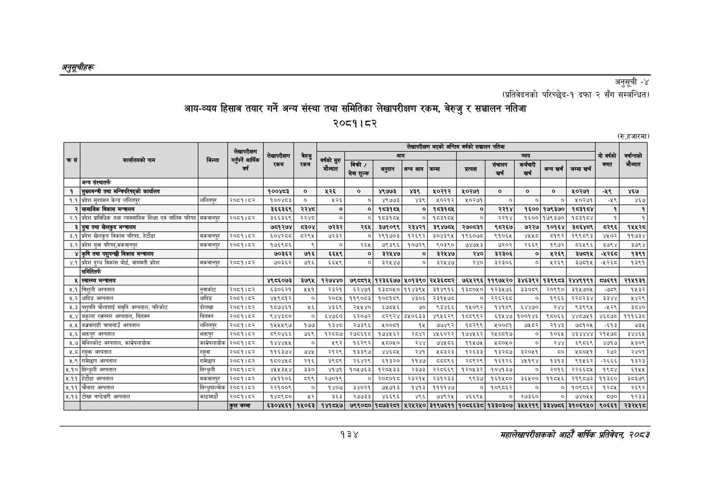

# Page 164 QA

## Rendered page


## Extracted text

```text
अनुतूचीहरू
अनुसूची -४
(प्रतिवेदनको परिच्छेद-१ दफा २ सँग सम्बन्धित)
आयन-व्यय हिसाब तयार गर्ने अन्य संस्था तथा समितिका लेखापरीक्षण रकम, बेरुजु र सञ्चालन नतिजा २०८१। ८२
(रु.हजारमा)
१३४
सहालेखापरीक्षकको आठाँ वाषिकि प्रतिवेदन २०८२

|  |  |  | लेखापरीक्षण |  |  |  |  |  | लेखापरीक्षण | भएको अन्तिम | वर्षको | सञ्चालन नतिजा |  |  |  |  |  |
| --- | --- | --- | --- | --- | --- | --- | --- | --- | --- | --- | --- | --- | --- | --- | --- | --- | --- |
| कसै | कार्यालयको नाम | बिल्ला | आर्षिक | केापरीकषण | चेरजु | सुरु |  |  |  |  |  |  |  |  |  |  | दु |
|  |  |  | गर्नुपर्ने वर्ष | कम | रकम | बर्षको मौज्दात | भनिकी? सेवा शुल्क | अनुदान | अन्य आय | जम्मा | प्त्यक | सँचालन खर्च | कर्मचारी खर्च | अन्य खर्च | जम्माखर्व | षत |  |
|  | अन्य संस्थातर्फ |  |  |  |  |  |  |  |  |  |  |  |  |  |  |  |  |
| १ | मुख्यमन्त्री तथा मन्त्रिपरिषद्को कार्यालय |  |  | १००४८३ | ० | ५२६ | ० | ४९७७३ | ४३९ | ०२१२ | ४१०२७१ | ० | ० | ० | ०२७१ | -६९ | ४६७ |
| १.१ | प्रदेश सुशासन केन्द्र ललितपुर | ललितपुर | २०६१।६२ | १००४८३ | ० | ५२६ | ० | ४९७७३ | ४३९ | ४०२१२ | १०२७१ | ० | ० | ० | १०२७१ | -५९ | ४६७ |
|  | सामाजिक विकास मन्त्रालय |  |  | ३६६३६९ | २२४८ | ० | ० | १८३१८४ | ० | १८३१८४ | ० | र२२१४ | १६०० | १७९३७० | १८३१८४ | १ | १ |
| २.१ | प्रदेश प्राविधिक तथा व्यवसायिक शिक्षा एवं तालिम परिषद | मकवानपुर | २०८१।५२ | ३६६३६९ | २२४८ | ० | ० | १८३१५४५ | ० | १८३१५४५ | ० | २२१४ | १६०० | १७९३७० | १८३१८४ |  | १ |
| ३ | युवा तथा खेलकुद मन्त्रालय |  |  | ७८१२७४ | ८३०४ | ७२३२ | २६५ | ३७१०९९ | २३४२१ | ३९४७८५ | २७०८३१ | ९८२६७ | ७२२७ | १०१६४ | ३८६४८९ | ८२९६ | १५४२८ |
| ३.१ | प्रदेश खेलकृद विकास परिषद, हेटौडा | मकवानपुर | २०८१।८२ | ०४२८ | ८२९४ | ७२३२ | ० | २९१७०३ | १२६९२ | ३०४३९५ | १९६०७८ | ९१०६४ |  | ८१९२ | २९९८९३ | ४५०२ | ११७३४ |
| ३.२ | प्रदेश युवा परिषद्‌,मकवानपुर | मकवानपुर | २००१।८२ | १७६९८६ |  | ० | २६४५ | ७९३९६ | १०७२९ | ९०३९० | ७४७५३ | ७२०२ | २६६९ | १९७२ | ८६५९६ | ३७९४ | ३७९४ |
|  | कृषि तथा पशुपन्छी विकास मन्त्रालय |  |  | ७०३६२ | ७१६ | ६६४९ | ० | ३२४४७ | ० | इ२१४७ | र४० | ३२३०६ | ० | २६९ | ३७५१५ |  | १३९१ |
| ४.१ | प्रदेश दुग्ध विकास बोर्ड, बागमती प्रदेश | मकवानपुर | २०८१।८२ | ७०३६२ | ७१६ | ६६५९ | ० | ३२१४७ | ० | ३२१४७ | २४० | ३२३०६ | ० | १२६९ | ३७८१५ | -५२६८ | १३९१ |
|  | 'समितितर्फ |  |  |  |  |  |  |  |  |  |  |  |  |  |  |  |  |
| ५ | स्वास्थ्य मन्त्रालय |  |  | ४९८६०७३ | ३७९५ | १२७४४० | ७९८८१५ | १२३६६७७ | ५०१३९० | २५३६८८२ | ७६४२९६ | ११९७४२० | ३४६३९२ | १३९९८३ | २४४९१९१ | ८७६९१ | २१४१३१ |
| ५.१ | बिजुली अस्पताल | नुवाकोट | २०६१।८२ | ६३०६२१ | ५४१ | २३२१ | ६२४७१ | १३८०५० | ११४३९४५ | ३१४९१६ | १३८०५० | १२३५७६ | ३३०९ | २०९९० | ३१४५७०५ | ७८९ | १४३२ |
| ५.२ | धादिङ अस्पताल | धादिङ | २०८१।८२ | ४५९८१२ | ० | २०८५ | ११९०८३ | १०८१८९ | ४३०६ | २३१५७८ | ० | २२६२६८ | ० | १९६६ | २२८२३४ | ३३४४ | २४२९ |
| ५.३ | पशुपति चौलागाई समृति अस्पताल, चरिकोट | दोलखा | २०६१।८२ | १५७४६१ | १२६ | ४३६९ | र२४१४४० | ६७०४५६ | ७० | ९३४६६ | १५०९२ | ११८९ | ६४४७० | र४४ | ९३९९५ |  | ३८४० |
| ५.४ | बकुलर र्ननगर अस्पताल, चितवन | चिता | २०५१।८२र | ९४४३५० | ० | इ४७६० | इ२०७२ | ८२९२४ | ३५०६३३ | ४९५६२९ | १८८९९२ | ६१४४७ | १००१४६ | ९८०६६ | ४४८७५१ | ४६८७८ | १११६३८ |
| ५.४ | बज्रबाराही चापागाउँ अस्पताल | ललितपुर | २०६१।८२ | १५४५९७ | १७७ | १इ४८ | २७३९६ | ००६१ | १५ | ७७४९२ | १८२६९ | ४५००८१ | ७६८२ | २१४३ | ७६१०५ | -६१३ | ७३१ |
| ५.६ | भक्तपुर अस्पताल |  | २०८१।४२ | ८९०४६६ | ७६९ | १२८८७ | २७८६१८ | १७४५६२ | २८४२ | ४५६०२२ | १७४५६२ | २५८६१७ | ० | १०६५ | ४३४४४४ | २१५७८ | ३४४६५ |
| ५.७ | भेविनकोट अस्पताल, काभ्रेपलाबोक | काभ्रेपलाचोक | २०८१।८२ | १४४४५४५ | ० | ९२ | १६२९६२ | ८०५० | र४४ | ७४५८६ | ११५७५ | १५०५० | ० | र४४ | ६९५८६९ | ४७१७ | १३०९ |
| ५.८ | रसुवा अस्पताल | रसुवा | २०८१।४२ | ११६३७४ | ७४५ | २१२९ | १३३९७ | ४४६०५ | र२४१ | ८३२३ | १२६३३ | १३२८७ | ३२०५१ | ५० | ८०५१ | २७२ | २४०१ |
| ५.९ | रामेछाप अस्पताल | रामेछाप | २०८१। ८२ | दण्ड | २१६ | ३९८६ | २६४२६९ | ६१३२० | ११४७ | वयय९६ङ | २०८६२९ | १६१२६ | ४४५१९४ | १३१३ | ९१५६२ | -२६६६ | १३२३ |
| ५.१० | सिन्धुली अस्पताल | सिन्चृली | २०८१।८२ | ४४५४३४४ | ३३० | ४१७१ | १०४७६३ | १२०४३३ | २३७३ | २२८६६९ | १२०५३२ | १०४१३७ | ० | २०१६ | २२६६०५ | १९८४ | ६१५१ |
| ५.११ | हेटौडा अस्पताल | मकवानपुर | २०८१।८
```

## Flags
- table_page
- medium_quality_table
