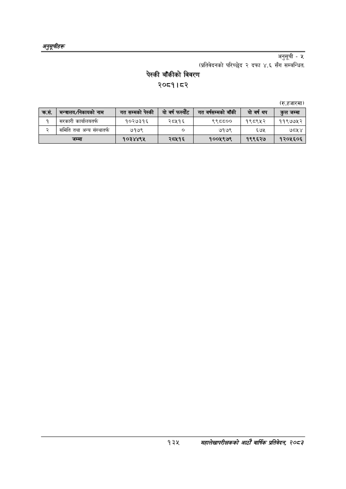

# Page 165 QA

## Rendered page


## Extracted text

```text
अनुतूचीहरू
अनुसूची -५
(प्रतिवेदनको परिच्छेद २ दफा ४.६ सँग सम्बन्धित,
पेस्की बाँकीको विवरण २०८१।८२
(रु.हजारमा)
१३२
सहालेखापरीक्षकको वाषिकि प्रतिवेदन २०८२

| कसे. | मन्तरालय/निकावको नाम | 'गत सम्मको पेस्की | यो वर्ष फस्यौट | गत षर्पसन्भको बाँकी | योवर्ष थप | कुल जम्मा |
| --- | --- | --- | --- | --- | --- | --- |
| १ | सरकारी कार्यालबतर्फ | १०२७३१६ | २८५१६ | ९९८८०० | १९८९५२ | ११९७७१२ |
| २ | समिति तथा अन्य संस्थातर्फ | ७१७९ |  | ७१७९ | ६७५ | ७८५४ |
|  | जम्मा | १०३४४९४५ | २८५१६ | १००५९७९ | १९९६२७ | १२०५६०६ |
```

## Flags
- table_page
- medium_quality_table
