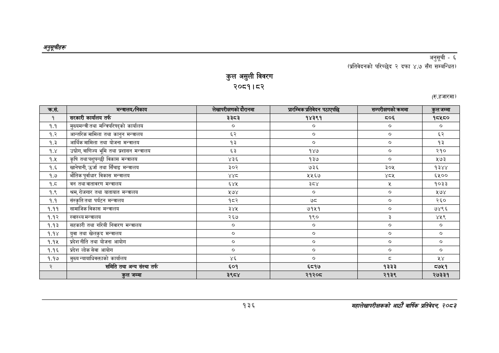

# Page 166 QA

## Rendered page


## Extracted text

```text
अनुतूचीहरु
कुल असुली विवरण २०८१। ८२
अनुसूची -६
(प्रतिवेदनको परिच्छेद २ दफा ४.७ सँग सम्बन्धित)
(रि.हजारमा)
१३६
महालेखापरीक्षकको आठौँ वाषिकि प्रतिवेदन २०८२

| कस. | 'मन्त्रालय/निकाय | 'लेखापरीक्षणको [ | आएन्मिक अतिनदन पठाएपछि | सम्परीकषणको क्रममा |  |
| --- | --- | --- | --- | --- | --- |
| १ | सरकारी कार्यालय तर्फ | ३३५३ | १४३९१ | ०६ | ९५४५० |
| १.१ | मुख्यमन्त्री तथा मन्त्रिपरिषद्को कार्यालय | ० | ० | ० | ० |
| १.२ | आन्तरिक मामिला तथा कानुन मन्त्रालय | ६२ | ० |  | ६२ |
| १.३ | आर्थिक मामिला तथा योजना मन्त्रालय | १३ |  | ० | १३ |
| १.४ | उद्योग, वाणिज्य भूमि तथा प्रशासन मन्त्रालय | ६३ | १४७ | ० | २१० |
| १.५ | कृषि तथा पशुपन्छी विकास मन्त्रालय | ४३६ | १३७ | ० | ५७३ |
| १.६ | खानेपानी, उर्जा तथा सिँचाइ मन्त्रालय | ३०२ | ७३६ | ३०५ | १३४४ |
| १.७ | भौतिकपूर्वाधार विकास मन्त्रालय | १११ | ५५६७ |  | ६१०० |
| १.८ | तथा वातावरण मन्त्रालय | ६४४ | ३४ |  | १०३३ |
| १.९ | श्रम,रोजगार तथा यातायात मन्त्रालय | ५७४ | ० | ० | ५७४ |
| १.१ | संस्कृति तथा पर्यटन मन्त्रालय | १८२ | ७८ | ० | २६० |
| १.११ | सामाजिक विकास मन्त्रालय | ३४४५ | ७१५१ | ० | ७४९६ |
| १.१२ | स्वास्थ्य मन्त्रालय | २६७ | १९० | ३ | ४५९ |
| १.१३ | सहकारी तथा गरिवी निवारण मन्त्रालय | ० | ० | ० | ० |
| १.१४ | युवा तथा खेलकुद मन्त्रालय | ० | ० | ० | ० |
| १.१५ | प्रदेशनीति तथा योजना आयोग | ० | ० | ० |  |
| १.१६ | प्रदेश लोकसेवा आयोग | ० | ० | ० |  |
| १.१७ | मुख्य न्याथाधिवक्ताको कार्यालय | ४६ | ० |  | श४ |
| २ | 'समिति तथा अन्य संस्था तर्फ | ६०१ | ६८१७ | १३३३ | ८७५१ |
|  | जम्मा | ३९८४ | २१२०८ | २१३९ | २७३३१ |
```

## Flags
- table_page
- medium_quality_table
