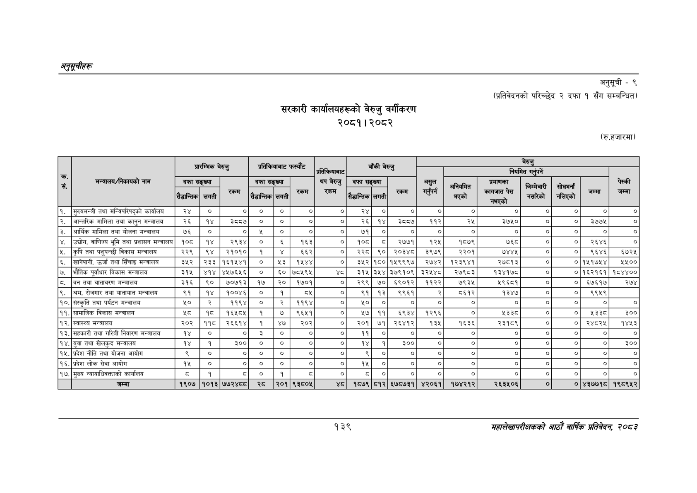

# Page 169 QA

## Rendered page


## Extracted text

```text
अनुतूचीहरु
सरकारी कार्यालयहरूको बेरुजु वर्गीकरण २०८१। २०८२
अनुसूची -९
(प्रतिवेदनको परिच्छेद २ दफा १ सँग सम्बन्धित)
(रु.हजारमा)
१३९
सहालेखापरीक्षकको आठोँ वा्िकै प्रतिवेदन; २०८२

|  |  |  | प्रारम्भिक |  | प्रतिक्रियाबाट |  | फस्यौट |  |  | बाँकी |  |  |  |  | बेरुजु |  |  |  |
| --- | --- | --- | --- | --- | --- | --- | --- | --- | --- | --- | --- | --- | --- | --- | --- | --- | --- | --- |
|  |  |  |  | बेरुजु |  |  |  | प्रतिकियाबाट |  |  | बेरुजु |  |  | नियमित | गर्नुपर्ने |  |  |  |
| - सं | मन्त्रालय/निकायको नाम | दफा | सङ्ख्या | जा | दफा लिदा | सङ्ख्या | बा | थप बेरुजु \| पा | दफा लि | सङ्ख्या | ता | असुल \| पन | अनियमित \| त | प्रमाणका क | जिम्मेवारी नसारेको | सोधमनना नलिएको | नम्मा | चेस्की जेम्मा |
| १. | मुख्यमन्त्री तथा मन्त्रिपरिषद्को कार्यालय | २४ | ० | ० | ० | ० | ० | ० | २४ | ० | ० | ० | ० | ० | ० | ० | ० | ० |
| २. | आन्तरिक मामिला तथा कानुन मन्त्रालय | २६ | १४ | ३५५७ | ० | ० | ० | ० | २६ | १४ | ३८८७ | ११२ | २५ | ३७५० | ० | ० | ३७७५ | ० |
| ३. | आर्थिक मामिला तथा योजना मन्त्रालय | ७६ | ० | ० | ४ | ० | ० | ० | ७१ | ० | ० |  |  | ० | ० | ० | ० | ० |
| ४. | , वाणिज्य भूमि तथा प्रशासन मन्त्रालय | १०८ | १४ | २९३४ | ० | ६ | १६३ | ० | १०८ | ८ | २७७१ | १२५ | १८७९ | ७६८ | ० | ० | २६४६ | ० |
| ५. | कृषि तथा पशुपन्छी विकास मन्त्रालय | २२९ | ९४ | २१०१० | १ |  | ६६२ | ० | २२८ | ९० | २०३४८ | ३९७९ | २२०१ | ७४४४ | ० | ० | ९६४६ | ६७२५ |
| ६. | खानेपानी, उर्जा तथा सिँचाइ मन्त्रालय | ३५२ | २३३ | १६११४१ | ० | ६३ | ११४४ | ० | ३ | १८० | १५९९९७ | २७४२ | १२३९४१ | २७८१३ | ० |  | ०१५१७५४ | १५०० |
| ७. | भौतिक पूर्वाधार विकास मन्त्रालय | ३१५ | ४१४ | ४५७६५६ | ० | ६० | ७८१९४५ |  | ३१५ | ३५४ | ३७९१०९ | ३२४८४८ | २७९८३ | १३४१७८ | ० | ० | १६२१६१ | १८४४०० |
| ८. | बन तथा वातावरण मन्त्रालय | ३१६ | ९० | ७०७१३ | १७ | २० | १७०१ | ० | २९९ | ७० | ६९०१२ | ११२२ | ७९३५ | ५९६८१ | ० | ० | ६७६१७ | २७४ |
| ९. | श्रम, रोजगार तथा यातायात मन्त्रालय | ९१ | १४ | १००४६ | ० | १ | दश | ० | ९१ | १३ | ९९६१ |  | ८६१२ | १३४७ | ० | ० | ९९५९ |  |
| १०, | संस्कृति तथा पर्यटन मन्त्रालय | ५० | २ | ११९४ | ० | २ | ११९४ | ० | १० | ० | ० | ० | ० | ० | ० | ० | ० | ० |
| ११. | सामाजिक विकास मन्त्रालय | श८ | ८ | १६५८५ | १ | ७ | ९६११ | ० | १७ | ११ | ६९३४ | १२९६ | ० | १३३८ | ० | ० | १३३८ | ३०० |
| १२. | स्वास्थ्य मन्त्रालय | २०२ | ११८ | २६६१४ | १ | ४७ | २०२ | ० | २०१ | ७१ | २६४१२ | १३५ | १६३६ | २३१८९ | ० | ० | २४८२५ | १४५३ |
| १३. | सहकारी तथा गरिवी निवारण मन्त्रालय | १४ |  | ० | ३ | ० | ० | ० | ११ | ० |  | ० | ० | ० | ० | ० | ० | ० |
| १४. | युवा तथा खेलकुद मन्त्रालय | १४ | १ | ३०० | ० | ० | ० | ० | १४ | १ | ३०० | ० | ० | ० | ० | ० |  | ३०० |
| १५. | प्रदेश नीति तथा योजना आयोग | ३ |  | ० | ० | ० | ० | ० | ९ | ० |  | ० | ० | ० | ० | ० | ० | ० |
| १६. | प्रदेश लोक सेवा आयोग | १५ | ० | ० | ० | ० | ० | ० | १५ | ० | ० | ० | ० | ० | ० | ० | ० | ० |
| १७. | मुख्य न्यायाधिकक्ताको कार्यालय | ३ | १ | डड |  | १ | ३ | ० | छ | ० | ० | ० | ० | ० | ० | ० | ० | ० |
```

## Flags
- table_page
- medium_quality_table
