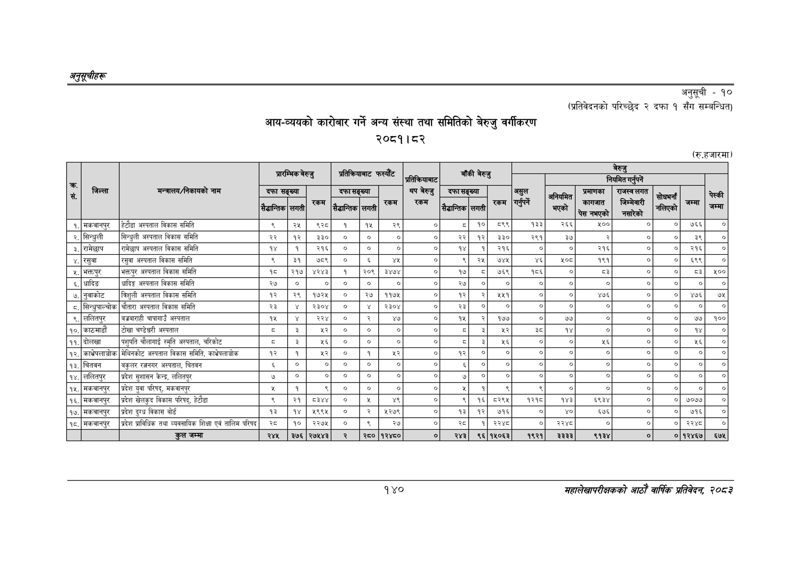

# Page 170 QA

## Rendered page


## Extracted text

```text
अनुतूचीहरु
आयन-व्ययको कारोबार गर्ने अन्य संस्था तथा समितिको बेरुजु वर्गीकरण २०८१। ८२
अनुसूची -१०
(प्रतिवेदनको परिच्छेद २ दफा १ सँग सम्बन्धित)
(रु.हजारमा)
१४०
महालेखापरीक्षकको आठौँ वाषिकि प्रतिवेदन २०८२

|  |  |  | प्रारम्भिक |  | बेरुजु | प्रतिक्रियाबाट |  | फस्यौट | प्रतिकरियाबाट | बाँकी | बेरुजु |  |  |  |  | बेरुजु |  |  |  |
| --- | --- | --- | --- | --- | --- | --- | --- | --- | --- | --- | --- | --- | --- | --- | --- | --- | --- | --- | --- |
| सं | जिल्ला | मन्त्रालय/निकायको नाम | दफा सैडान्तिक | सङ्ख्या लगती | रकम | दफा सैद्धान्तिक | सङ्ख्या लगती | रकम | थप बेरुजु रकम | दफासङ्ख्या सैद्धान्तिक | लगती | रकम | झा गर | अनियमित भएको | प्रमाणका 'कागजात चेस चल्छ | ह्थ रे | 'नलिएको | जम्मा | चेस्की |
| १. | मकवानपुर | हेटौडा अस्पताल विकास समिति | ९ | २५ | ९२८ | १ | १५ | २९ | ०. | ५ | १० | ५८९९ | १३३ | २६६ | ५०० | ० | ० | ७६६ | ० |
| २. | सिन्धुली | सिन्धुली अस्पताल विकास समिति | २२ | १२ | ३३० | ० | ० | ०. | ०. | २२ | १२ | ३३० | २९१ | ३७ | २ | ० | ० | इ९ | ० |
| ३. | रामेछाप | रामेछाप अस्पताल विकास समिति | १४ | १ | २१६ | ० | ० | ० | ०. | १४ | १ | २१६ | ० | ० | २१६ | ० | ० | २१६ | ० |
| ४. | रसुवा | रसुवा अस्पताल बिकास समिति | ९ | ३१ | ७८९ | ० | ६ | थत | ०. | ९ | २५ | ७४५ | ४६ |  | १९१ | ० | ० | ६९९ | ० |
| ५. | भक्तपुर | भक्तपुर अस्पताल विकास समिति | १८ | २१७ | ४२४३ | १ | २०९ | ३४७४ | ० | १७५ | ८ | ७६९ | १८६ | ० | ३ | ० | ० | ६३ | ४१०० |
| ६. | धादिङ | धादिङ्ग अस्पताल विकास समिति | २७ | ० | ० | ० | ० | ०. | ०. | २७ | ० | ० | ० | ० | ० | ० | ० | ० | ० |
| ७. | नुवाकोट | तिशुली अस्पताल विकास समिति | १२ | २९ | १७२५ | ० | २७ | ११७५ |  | १२ | २ | १४५१ | ० | ० | ४७६ | ० | ० | ४७६ | ७५ |
| ८. | सिन्धुपाल्चोक | चौतारा अस्पताल बिकास समिति | २३ | ४ | २३०४ | ० | ४ | २३०४ | ०. | २३ | ० | ० | ० | ० | ० | ० | ० | ० | ० |
| ९. | ललितपुर | बज्रबाराही चापागाउँ अस्पताल | १५ | ४ |  | ० | २ | ४७ | ० | १५ | २ | १७५ | ० | ७७ | ० | ० | ० | ७७ | १०० |
| १०. | काठमाडौं | टोखा चण्डेघ्वरी अस्पताल | ३ | ३ | २२ | ० | ० |  |  | ५ | ३ | १२ | ्द | १४ | ० | ० | ० | १४ | ० |
| ११. | दोलखा | पशुपति चौलागाई स्मृति अस्पताल, चरिकोट | ३ | २ | २६ | ० | ० | ० | ० | डड | ३ | ४६ | ० | ० | ५६ | ० | ० | ४६ | ० |
| १२. | काभ्रेपलाञ्चोक | मेबिनकोट अस्पताल विकास समिति, काभ्रेपलाञ्चोक | १२ | १ | ५२ | ० | १ | ५२ | ०. | १२ | ० | ० | ० | ० | ० | ० | ० | ० | ० |
| १३. | चिततन | बकुलर रत्ननगर अस्पताल, चितवन |  | ० | ० | ० | ० | ० | ० | ६ | ० | ० | ० | ० | ० | ० | ० | ० | ० |
| १४. | ललितपुर | प्रदेश सुशासन केन्द्र, ललितपुर | ७ | ० | ० | ० | ० | ० | ० | ७ | ० | ० | ० | ० | ० | ० | ० | ० | ० |
| १५. | मकवानपुर | प्रदेश युवा परिषद्‌, मकवानपुर | [क | १ | ९ | ० | ० | ० | ० | ५ | १ | ९ | ९ | ० | ० | ० | ० | ० | ० |
| १६. | मकवानपुर | प्रदेश खेलकुद विकास परिषद्‌, हेटौडा | ९ | २१ |  | ० |  |  | ० | ९ | १६ | ८२९५ | १२१९ | १४३ | ६९३४ | ० | ० | ७०७७ | ० |
| १७. | मकवानपुर | प्रदेश दुग्ध विकास बोर्ड | १३ | १४ | १९९५ | ० | २ | १२७९ | ० | १३ | १२ | ७१६ | ० | ४० | ६७६ | ० | ० | ७१६ | ० |
| १८. | मकवानपुर | प्रदेश प्राविधिक तथा व्यवसायिक शिक्षा एवं तालिम परिषद | २८ | १० | २२७५ | ० | ९ | २७ | ० | स्व | १ | २२४८ | ० | २२४८ | ० | ० | ० | २२४८ | ० |
|  |  | हल जम्मा | २४५ | ३७६ | २७४४३ | २ |  | १२४८० | ० | २४३ | ९६ | १५०६३ | १९२१ | ३३३३ | ९१३४ | ० |  | ०१२४६७ | ६७५ |
```

## Flags
- table_page
- medium_quality_table
