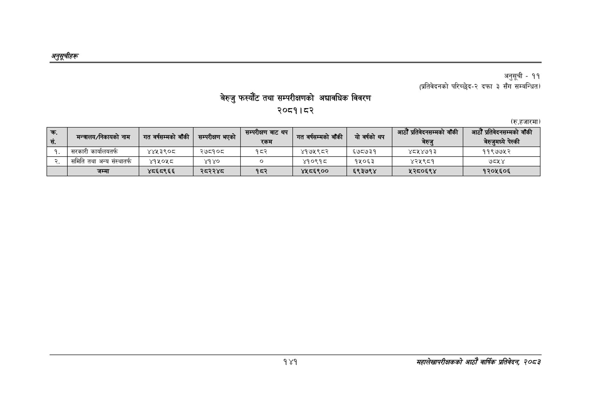

# Page 171 QA

## Rendered page


## Extracted text

```text
अनुतूचीहरु
बेरुजु फस्यौट तथा सम्परीक्षणको अद्यावधिक विवरण २०८१। ८२
अनुसूची -११
(प्रतिवेदनको परिच्छेद-२ दफा ३ सँग सम्बन्धित)
(रु.हजारमा)
१४१
महालेखापरीक्षकको आठौँ वाषिकि प्रतिवेदन २०८२

| सं. | मन्त्रालय/निकायको नाम | गत वर्षसम्मको बाँकी | सम्परीक्षण भएको | उ रकम | गत वर्षसम्मको बाँकी | यो वर्षको थप | ४२४५ \| बेरुजु | बेरुजुमध्ये पेस्की |
| --- | --- | --- | --- | --- | --- | --- | --- | --- |
| १. | सरकारी कार्यालयतर्फ | ४४५३९०८ | २७८१०८ | १८२ | ४१७५९८२ | ६७८७३१ | ४८५४७१३ | ११९७७५२ |
| २. | समिति तथा अन्य संस्थातर्फ | ४१५०५८ | ४१४० | ० | ४१०९१८ | १५०६३ | ४२५९८१ | ७८५४ |
|  | जम्मा | ४८६८९६६ | २८२२४८ | १८२ | ४५८६९०० | ६९३७९४ | ५२८०६९४ | १२०५६०६ |
```

## Flags
- table_page
- medium_quality_table
