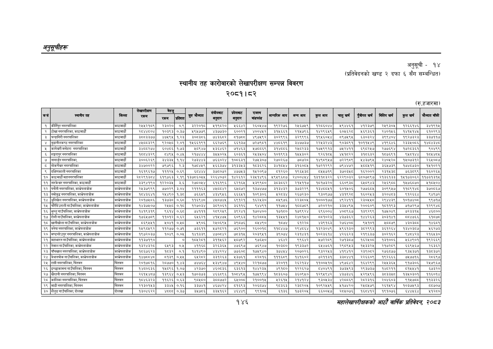

# Page 176 QA

## Rendered page


## Extracted text

```text
अनुतूचीहरू
स्थानीय तह कारोबारको लेखापरीक्षण सम्पन्न विवरण २०८१।८२
अनुसूची -१४ (प्रतिवेदनको खण्ड २ दफा ६ सँग सम्बन्धित)
(रु.हजारमा)
१४६
सहालेखापरीक्षकको आठाोँ वाषिकि प्रतिवेदन २०८२

| कसै | स्थामीय तह | बिल्ता | लेखापरीक्षण रकम |  |  | सुरु मौज्यात | बैहुकाट | काट |  | आन्तरिक बाय | बन्यआय | कुसबाय | चातुखर्ष | पुँजीगत खर्ष | मित्तिय बर्ष | कुल खर्ष |  |
| --- | --- | --- | --- | --- | --- | --- | --- | --- | --- | --- | --- | --- | --- | --- | --- | --- | --- |
| १ |  | काठमाडौं | र२४४२१५९ | २३०२० | ०.९ | इरर७१८ | १९०२०। | अ६६४२ | २६०४४७ | १९२२७६ | २४६७४९ |  | अ९४४६१। | ४१२३७९ |  | १२६६१४६ | ३४१९१५ |
| २ | टोखा नगरपालिका, काठमाडौं | काठमाडौं | २८४४८०४ | १०३९३ | ०.३७ | ५९५७७९ | ४३७७३० | ६५००२१ | ४००४५२ | ३१५६६१ | २१५७९६ | १४२९६४५९ | ५०५६२८ | ५६९३६१ | २४०१५६ | १४१५१४५ | ५१०२९३ |
| ३ | चन्द्रागिरी नगरपालिका | काठमाडौं | ३८८३३७७ | ४७५९५ | १.२३ | ३०८३८६ | ७४३६८२ | ८१७८ | ४९७५९२ | ३०२९९६ | ३२९९९६ | १९५६०४५४ | ८९७५९५ | ६३०३२४ | ३९९४०४ | १९२७३२३ | ३३७११७ |
| ४ | जनाका लाला | काठमाडौं | ४४००३२९ | २०४८ | २०१ | क४५६६१९१ | ब६२७६९ | ४४४३० | ७२७९०१ | ४४६९ | इ४७७३७ | २२४३२४३ | ९०३०९१ | १०११४४९ | १९४६ | २३३४०७६ | पठाइ |
| ५ | कागेश्वरी मनोहरा नगरपालिका | काठमाडौं | ३४८८२७४ | ६०४८६ | १.७३ | २८९४७ | ५३६४६२ | ७१४६३ | २५७८८६९ | ३१४८८६ | २५८२३३ | १७५९९१३ | ७५२४११ | ६९८२५७ | २७७६९४ | १७२८३६१ | ९०४९९ |
| ६ | नगरपालिका | काठमाडौं | १८८४३२९ | ५४९५ | ०,४४५ | २१७४४४ | ३५५०२५ | ५०३६१ | २५३४५०४ | १०१९९३ | १५५३०२ | ९२६१०४५ | ४५१८२२ | ३१८६३२ | १८०७६९१ | ९५८१४४ | १८४५४८५ |
| ७ | नागाईुन नगरपालिका, | काठमाडौं | इ३००६२६९ | ४३३४ | पप | २७३४४३ | ७६६०२४ | ब०८६३१ | र२७४३०७ | र२७०२६७ | ७०२८ | १४९८९४७ | ७२२९८९ | ४४३७९४ | र४०४२८ | १४०७३१२ | २६४००४ |
| ८ | गोकर्णे्वर नगरपालिका | काठमाडौं | ३४७००२२ | ७९७९६ | २.३ | १७८४५९ | १५६६३७४ | ३१३३५३ | १८३६२६ | ३४१८५४ | ३१६०८५ | १७२१२९२ | ७९४४७२ | ५८८५१९ | ३६४५७३९ | १७४८७३० | १५१०२१ |
| ९ | दक्षिणकाली नगरपालिका | काठमाडौं | १६१९६१७ | १११२५ | ०.६९ |  | ३७८०७२ | ४७७५३ | १४५२०९७ | ८१२६० | १९६५३८ | ८५५७१९ | ३७०३५८ | १६२००२ | २३१४५३८ | ७६३८९९ | १६०२६४५ |
| १० | काठमाडौं महानगरपालिका | काठमाडौं | २८२९१३८४ | ६१९७६३ | २.१९ | १३७८६०५५ | २२६४०७२ | १४२६१२ | २३५१४६६ | २५९५९६८७ | २४००४४५४ | १३११८३२२ | ६५२२९०३२ | ६८०७८९७ | २१३६१३३ | १५१७३०६२ | ११७३१३१५ |
| ११ | तारकेश्वर नगरपालिका, काठमाडौँ | काठमाडौं | ३३९४१९० | १२२०३५ | ३.६ | २७८०४४ | ६१६१९६ | ६२१६४ | ४३९९८० | इ३८३८६२ | २१४११७ | १८१७३२० | ६६०९३८ | ६४८९४३ | र२४१६९८८ | १४७६८७० | ११८४०४ |
| १२ | पनौती नगरपालिका, काभ्रेपलाञ्चोक | काभ्रेपाचोक | २५३७९९९ | ७७०२९ | ३.०४ | २१११६३ | ४४१८०४२ | ६१८७२ | १३७४७७ | ३१३४३२ | ३७३२२९ | १३४८८०५१ | ६०१५०६ | २७७६८५ | ३०९९५७ | ११८९१४८ | ३७०८६७ |
| १३ | नमोबुद्ध नगरपालिका, | काभ्रेपाबोक | १८०४३६४१ | २४४९० | १,३८४ | ७६४९ | ४३४९४६ | ६६५१ | १०९३०६ |  | २६७२३० | ९३०९७७ | ४३१९२८ | १६०२४३ | ३२०४७३ | द९१२६६४ | १४९७२ |
| १४ | घुलिखेल नगरपालिका, काभ्रेपलाञ्चोक | काभ्रेपाबोक | २०१७५८६ | १३७३८ | ०.६८ | ११६९४८ | ४५८७४५ | ६९१२१ | १६२५३० | ८५९७६ | २२३८०५ | १०००१७७ | ४९२४११ | २३०५५८० | २९४४३९ | १०१७४०८ | ९९७१७ |
| १५ | चाँरीदेउराली गाउँपालिका, काभ्रेपलाञ्चोक | काभ्रेपाबोक | १४३७४५०७ | २५५८ | ०.१८ | १२७०३४ | ३८९०६१ | ३६११६ | ९४४९१ | ११७५४ | १८८७८९ | ७२०२१० | ३३५४९५ | २००६०९ | १८११९३ | ७१७२९७ | १२९९४८ |
| १६ | अुम्तु गाउँपालिका, | कागरेपलाबोक | १४१९३१९ | ९६१४ | ०६८ | ७१११ | र२८९२४९ | इ९्र४१ | ब७०४०० | ७१८० | ब९्६र४ | ४०० | ४०५९६७ | १३९२९९ | १७५०४६ | ७२३३१५ | ४६५० |
| १७ | रोशी गाउँपालिका, काभ्रेपलाञ्चोक | काभ्रेपलाञ्चोक | १७६५७८९ | ११०१२ | ०.६२ | ६५६२१ | ४१५४७५ | ६०९६३ | १४२८८५ | १३५५१ | र२४८१५० | ५५१०२३ | ४३७३६२ | १४४२६३ | ३०३१४१ | ५८४७६६ | ६१८७८ |
| १८ | खानीखोला गाउँपालिका, काभ्रेपलाञ्चोक | काभ्रेपलाञोक | ५६९५५१ | २०४१ | ०.५८ | २९०६ | २४५०६९५ | ३९८७६ | ८५४९० | १८७४ | ६१२२८ | ४३९१६३ | २७६४०८ | ९६५१०१ | ५८८७९ | ४३०३८८ | १४६८१ |
| १९ | बनेपा नगरपालिका, काभ्रेपलाञ्चोक | काभ्रेपाचोक | १५९८०५९२ | ११२७७ | ०.७१ | ७३६११ | ४५७२८२१ | ७६९०० | २६००१८ | ११८४४७ | २९४८६४ | १३२३०४९ | २५९६१३० | ३८२९९३ | ३६१२६४४ | १३४०३८७ | २६२७३ |
| २० | माण्डनदैउपर नगरपालिका, कागरेपलाबोक | काग्रेपाबोक | १९७२०३७ | १०४९ |  | ४३३९ | ४७०५४२ | ७३१४ | र२०३९४१ | इ३९०७४ | र२३१४३१ | क०२३६क४ | ४२६६२३ | र२१९६३७ | ३०२१६२ | 
```

## Flags
- table_page
- medium_quality_table
