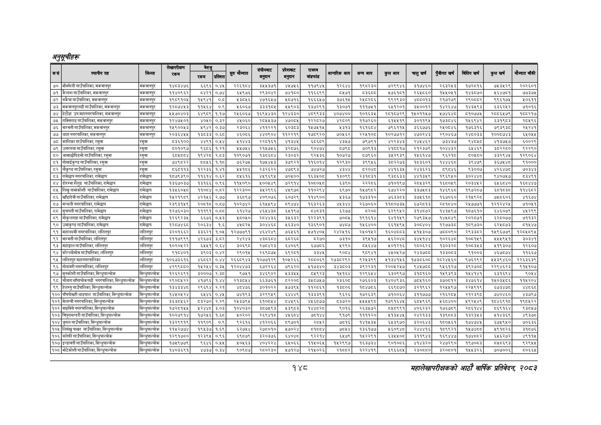

# Page 178 QA

## Rendered page


## Extracted text

```text
अनुतूचीहरू
१४८
महालेखापरीक्षकको आठोँ वार्षिक प्रतिवेदन २०५३

| कसै | स्थानीय तह | बिन्ता | लेखापरीक्षण रकममा | एम |  |  | बैहुकाट | ेकाबाट | पा | आन्तरिक बाय | बन्यआाय | कुसबाय | चा खर्च | पुँजीगत खर्ष | ित्तिय बर्ष | कुल खर्ष |  |
| --- | --- | --- | --- | --- | --- | --- | --- | --- | --- | --- | --- | --- | --- | --- | --- | --- | --- |
| ७० | भीमफेदी गाउँपालिका, मकवानपुर | मकवानपुर | १४८३४७६ | ६६९६ | ०.४५ | २२६१८४ | ३५५३७१ | ४५७५६ | ११७९४५ | १२६४४ | १९८२३० | ७२९९४६ | ३१७४६० | २६३२५३ | १७२८१६ | ७५३५२९ | २०२६०१ |
| २१ | कतार गाउँपालिका, मक्चानपर | मकवानपुर | ११४०९६२ | ८४२१ | ०७४ | इ४९७६ | २९३०४२ | ७४१८० | ११६६९९ |  | बाइट | ४७६१८१ | २६४०६० | ब४४०४१ | प४३५७० | १६४७८१ | ७३७५ |
|  | गाउँपालिका, मकबानपर | मकबानपुर | १९०९१०५ |  | ० |  | ४७१६४७ | ४०७६ | १६६६४७ | ७६१४ |  | द९२९३० | ४८००१३ | २१७२७९ | र२९०५८२ | ९१७४ | ०६११ |
| २५ | मकाजानापर, | मकबानपुर | १२८७४४३ | १४६४ | ०.९ | ६०६७ | ३३३१७४५ | ४९०३ | ३७२९१ | १३०७१ | १११७४१ | ६४९७०९ | ३४००१२ | १४२६४७ | १४३४९३ | इ३६२५२ | ७१०१६ |
| ७४ | हेटौडा उप महानगरपालिका, मकवानपुर | मकवानपुर | ५५७०४०३ | ४९८९ | १.१७ | २५६०६७ | १६९५४३० | १२४३३० | ४८९९३३ | ४०७४०० | १०१६३५ | २८१८७२९ | १५०११५७ | १२७४६४८ | ५१०७७५ | र२८८६५७९ | १८८२१७ |
| २४५ | राक्सिराइ गाउँपालिका, मकवानपुर | मकबानपूर | १२४७४०१ | ४०४० | ०३३ | ४५०६० | २०४४३७ | ४७०८४ | १२२८२७ | ४२८०९ | ११७२६० | द१५४१९ | इ०११९५ | १७३८४६ | प४६९४२ | बदइ९८३ | र२०४९६ |
|  | बाग्मती गाउँपालिका, सक्वानपर | मकवानपुर | १४९००४३ | ४९४२ | ०३७ | र३०६४ | ४११२२१ | ६०३३ | १४७४१४ | ४३१३ | बढाई | ७९६११४ | ३६६७७६ | र२४००४६ | १७६३१६ | ७९३द९३८ | र४२४१ |
| ७७ | थाहा नगरपालिका, मकवानपुर | मकवानपुर | २०३६४४५५ | ३८३३ | ०.६८ | ४६०६ | ४४०९०४ | ११२२१९ | १७५९२० | ७०४६२ | २२४१०४ | १०२७७१२ | ४७०२४३ | र२९०४६७ | र२४८०३३ | १००५७४३ | ५०५४ |
| ७८ | कालिका गाउँपालिका, रसुवा | 'रसुवा | ५३६१०० | ४४९१ | ०.४५४ | १४४३ | २२८१६१ | ४१३४४५ | ६८६८९ | ४३५७ | ७९७९१ | ४२२३४३ | २४५४६२ | ७३४३७ | ९४८४५८ | ४१३७५७ | ६००२९ |
|  | उसमा गाउँपालिका समा | रसुवा |  | दइ«इ | १२१ | ७४४ | २१४७४६ | इ२०७६ | ब०४७४ |  | ७०९१३ | ४१७८१७ | २१२३७९ | १०४४३२ | इ४४६९ | इच२२८० | २२९० |
|  | आमादीतिङमो गाउँपालिका, रस | सनबा | बलभद्र | पदहरण | रा | १०९०७१ |  | २३०३२ | दर४३६ |  | ७९६० |  | पता | देइरपङ | ब०६०० | ३३२९४८ | २९०४ |
| <४ | गोसाईकृण्ड गाउँपालिका, | रसुवा | ७४९८२२ | ७०५६ | ११८ | ७६२७ | १७४४४३ | ३७९२१ | १६०४ | २९३० | ९९५६ | े८२२७३ | १०३६०१ | ब४४४६ड | ९४७९ | इ६७४४८ | ९१००० |
|  |  |  | ८६०११३ | ९३३३६ | १४१ | ४१०६ | र३२६२२ | ४७५९३ | ७७२७ |  |  | १६३४ | र४३६२६ |  | द३००७ | ४२६४७८ | ७०३४३ |
| ८३ | रामेछाप नगरपालिका, रामेछाप | रामेछाप | १८७९३९० | ११६१४ | ०.६२ | ८५६१६ | ४५९६९५ | ७०५०० | १६३४५०८ | १३०९९ | २३१८३१ | ९३८६३३ | ४४१३५९ | १९६९५० | ३०२४४८ | ९४०७५७ | ८३४९१ |
| ८४ | दोरम्बा जैलुङ गाउँपालिका, रामेछाप | रामेछाप | ३६७०३७ | ३१६६ | ०९६ | कक४०० | ४०४९ |  |  |  |  |  |  |  | र०३४७२ | द४६०४० | १६९४४७ |
| ५५ | निख तामाकोशी गाउँपालिका, रामेछाप | रामेछाप | ब३४६०४८ | १०८४ | ०५३ | २२३०० | इ३४२९९६ | ४४९७ | ब१०२९४ | ६९७० | २४७९८२ | ह७४२२० | इ३७५८३ | १४६९६८० | ९७२८७ | १५३८ | ११४६८२ |
| ८६ | खाँडादेवी गाउँपालिका, रामेछाप | रामेछाप | १५२१९८९ | ४२१५६ | २.७७ | ३६८९७ | ४०९०७६ | ६०७२९ | ११४९०० | २३६७ | १७३३१० | ७५३३८३ | ३७५६१८ | १६७०६० | २१५९२८ | ७५५६०६ | ४१६७४ |
| ५ | मन्थली नगरपालिका, रामेछाप |  | २३९३१४९ | ०७१७ | ०७७ | ०२७४२ | ४४९४ | पदा | इरइ | अह | २६७०६० | ११७०७३४ | डर | २०१५४० | २४७७ | बरपर् | ७१०१ |
| ८८ | सुनापती गाउँपालिका, रामेछाप | रामेछाप | १२७६०३० | १११९१ | ०.८८ | ६१४२७ | ४६४४३८ | ६५१९७ | ८४८३१ | ६२७७ | ८२०८ | ६२९९५२ | ३१४८७२ | १४३५९७ | १८७६१० | ६४६०७९ | १२९९ |
| ८९ | मोकुलगड्ग गाउँपालिका, रामेछाप | रामेछाप | १२६९६२३४ | ६६७६ | ०४३ | ८०४० | र२८४४३६ | ३४६३२ | १२२३९१ | ७०५४ | १९१६१४ | इ४११५९ | २७९३४७ | १४४८४९ | २०२८७१ | इ२८०७७ | ७११३२ |
| %० | उमाकृष्ड गाउँपालिका, रामेछाप | रामेश्वाप | कस्ट | २०६३४ | १.६ |  | इ०४४६८ | ६३४० | ब३६९०१ | छइ्डङछ | क४६४०० | इ६१४९४ | इ०८४०४ | १२७७३ड८ | १८९७३० | ६२५८७३ | ब१४४७ |
|  | महालकमी नगरपालिका, सलितपृर |  | ३२०१६६२ | ३३६२१ | १.०४ | १२७७७९१ |  | ७४६१ |  | र४२४१६ | र२४०१४२ | ६०४३ | ४१४३०७ | ७०७०९० | २९३३८२ | १४९६७७९ | १२०४८९४ |
| ९२ | बाग्मती गाउँपालिका, ललितपुर | 'ललितपुर | १११७९९९ | ४२६७३ | ३.८२ | २४२४
```

## Flags
- table_page
- medium_quality_table
