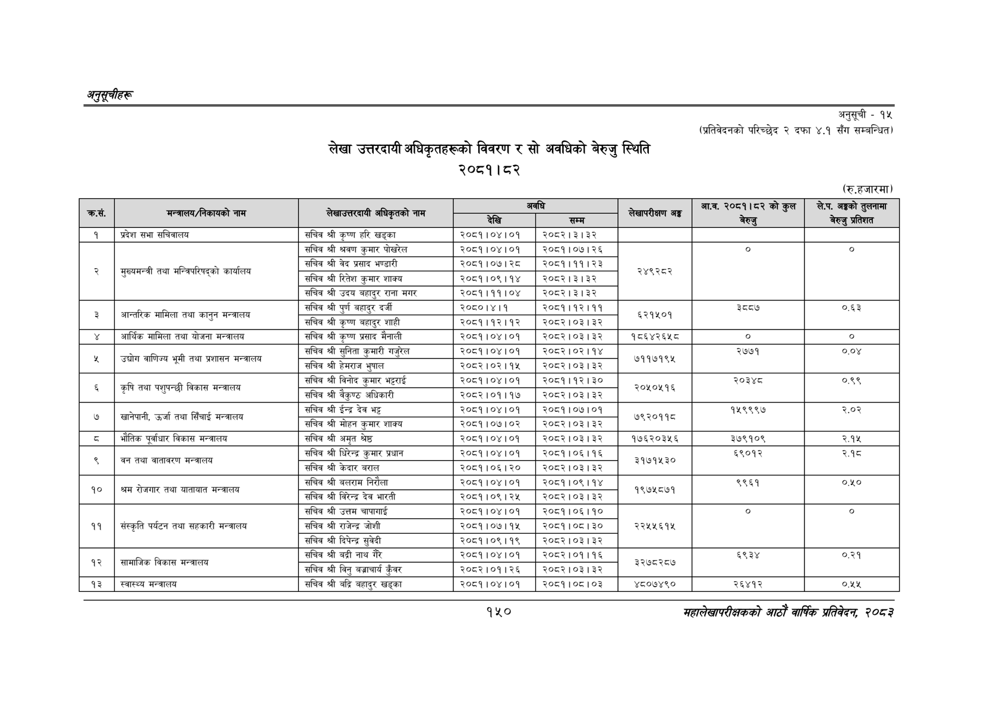

# Page 180 QA

## Rendered page


## Extracted text

```text
अनुतूचीहरू
लेखा उत्तरदायी अधिकृतहरूको विवरण र सो अवधिको बेरुजु स्थिति २०८१।८२
अनुसूची -१५
(प्रतिवेदनको परिच्छेद २ दफा ४.१ सँग सम्बन्धित)
(रु.हजारमा)
१५०
सहालेखापरीक्षकको आठाोँ वाषिकि प्रतिवेदन २०८२

| क्रस. | 'मन्त्रालय/निकायको नाम | 'लेखाउत्तरदायी अधिकृतको नाम | देखि | अवधि = | 'लेखापरीक्षण अङ्ग | आ.व. २०८१।८२ को बेरुजु कुल | , अङ्कको तुलनामा चेरजु प्रतिशत |
| --- | --- | --- | --- | --- | --- | --- | --- |
| १ | प्रदेश सभा सचिवालय | सचिव श्री कृष्ण हरि खड्का | २०६१।०४।०१ | २०८२।३।३२ |  |  |  |
|  |  | सचिव श्री श्रवण कुमार पोखरेल | २०८१।०४।०१ | २०८१।०७।२६ |  | ० | ० |
|  | मन्बिपरिषद्को मुख्यमन्त्री कार्यालय | सचिव श्री वेद प्रसाद भण्डारी | २०८१।०७। २८ | २०८१।११।२३ |  |  |  |
|  | तथा मन्त्रिपरिषद्को हि | स्तिश सचिव श्री रितेश कुमार शाक्य | २०८१।०९।१४ | २०८२।३।३२ | २४९२८२ |  |  |
|  |  | सचिव श्री उदय बहादुर राना मगर | २०८१।११।०४ | र२०८२।३।३२ |  |  |  |
|  | अन्तरिक मामिला | सचिव श्री पुर्ण बहादुर दर्जी |  | पठन १२१३ |  |  | ८३ |
| ३ | तथा कानुन मन्त्रालय = | सचिव श्री कृष्ण बहादुर शाही | २०८१।१२।१२ | २०८२।०३।३२ | ६२१५०१ |  |  |
| ४ | अआर्थिक मामिला तथा योजना मन्त्रालय | सचिव श्री कृष्ण प्रसाद मैनाली | २०८१।०४।०१ | २०८२।०३।३२ | १८६४२६५८ | ० | ० |
|  | उद्चोग वाणिज्य | सचिव श्री सुनिता कुमारी गर्ुरत |  | २००२।०२।१४ |  |  |  |
| ५ | भूमी तथा प्रशासन मन्त्रालय | सचिव श्री हेमराज भुषाल | २०८२।०२।१५ | २०८२।०३।३२ | ७११७१९५ |  |  |
|  | कृषि विकास | सचिव श्री विनोद कुमार भट्टराई | २०८१।०४।०१ | २०८१।१२। ३० |  | २०३४८ | ०.९९ |
| ६ | तथा पशुपन्छी मन्त्रालय = | सचिव श्री वैकुण्ठ अधिकारी | २०८२।०१।१७ | २०८२।०३।३२ | २०४०४१६ |  |  |
|  | खानेपानी, उर्जा सिँचाई | सचिव श्री ईन्द्र देव भट्ट | २०८१।०४।०१ | २०८१।०७।०१ |  | १५९९९७ | २.०२ |
| ७ \| | तथा मन्त्रालय | सचिव श्री मोहन कुमार शाक्य | २०८१।०७।०२ | २०८२।०३।३२ | कर्लकह |  |  |
| ८ | भौतिक पूर्वाधार विकास मन्त्रालय | सचिव श्री अमृत श्रेष्ठ | २०८१।०४।०१ | २०८२।०३।३२ | १७६२०३४५६ | ३७९१०९ | २.१५ |
|  |  | सचिव श्री घिरेन्द्र कुमार प्रधान | २०८१।०४।०१ | २०८१।०६।१६ |  | ६९०१२ | २.१८ |
|  | वन तथा वातावरण मन्त्रालय | सचिव श्री केदार बराल | २०८१।०६।२० | २०८२।०३।३२ | ३१७१५३० |  |  |
|  | रोजगार | सचिव श्री बलराम निरौला | २०८१।०४।०१ | २०८१।०९।१४ |  | ९९६१ | ०.५० |
| १० | श्रम तथा यातायात मन्वालय | सचिव श्री बिरेन्द्र देव भारती | २०८१।०९। २५ | २०८२।०३।३२ | १९७४८७१ |  |  |
|  |  | सचिव श्री उत्तम चापागाई | २०६१।०४।०१ | २०८१।०६।१० |  | ० | ० |
| ११ | संस्कृति पर्यटन तथा सहकारी मन्त्रालय | सचिव श्री राजेन्द्र जोशी | २०८१।०७।१५ | २०८१।०६।३० | २२५५६१५ |  |  |
|  |  | सचिव श्री दिपेन्द्र सुवेदी | २०८१।०९।१९ | २०८२।०३। ३२ |  |  |  |
|  | सामाजिक विकास | सचिव श्री बद्री नाथ गैरे | २०८१।०४।०१ | २०८२।०१।१६ |  | ६९३४ | ०.२१ |
| १२ | मन्त्रालय | सचिव श्री विनु वज्राचार्य कुँवर | २०८२।०१।२६ | २०८२।०३।३२ | ३२७८२८७ |  |  |
| १३ | स्वास्थ्य मन्त्रालय | सचिव श्री बद्रि बहादुर खड्का | २०८१।०४।०१ | २०८१।०८।०३ | ४८०७४९० | २६४१२ | ०.५४५. |
```

## Flags
- table_page
- medium_quality_table
