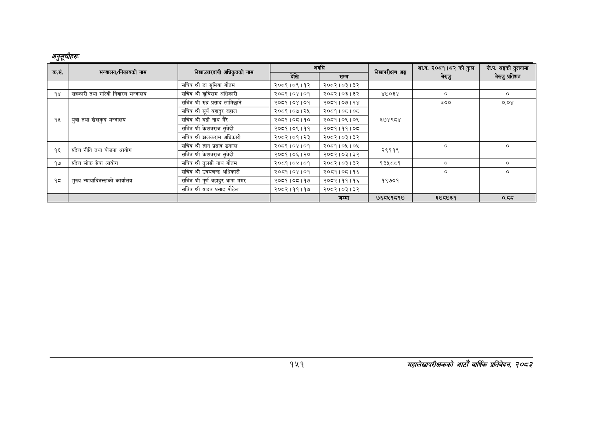

# Page 181 QA

## Rendered page


## Extracted text

```text
अनुतूचीहरू
९४९
सहालेखापरीक्षकको आठाोँ वाषिकि प्रतिवेदन २०८२

| कस. | मन्त्रालय/निकायको नाम | 'लेखाउत्तरदायी अधिकृतको नाम | देखि | को सम्म | 'लेखापरीक्षण अङ्ग | अक नत कोल | छ |
| --- | --- | --- | --- | --- | --- | --- | --- |
|  |  | सचिव श्री डा सुमित्रा गौतम | २०८१।०९।१२ | २०८२।०३।३२ |  |  |  |
| १४ | सहकारी तथा गरिबी निवारण मन्त्रालय | सचिव श्री खुविराम अधिकारी | २०८१।०४।०१ | २०८२।०३।३२ | ४७०३४ | ० | ० |
|  |  | सचिव श्री रुद्र प्रसाद लामिछाने | २०८१।०४।०१ | २०८१।०७।२४ |  | ३०० | ०.०४ |
|  |  | सचिव श्री सूर्य बहादुर दहाल | २०८१।०७।२५ | २०८१।०६।०८ |  |  |  |
| १५ | युवा तथा खेलकुद मन्त्रालय | सचिव श्री बद्री नाथ गैरे | २०८१।०८।१० | २०८१।०९।०९ | ६७४९८४ |  |  |
|  |  | सचिव श्री केशवराज सुवेदी | २०८१।०९।११ | २०८१।११।०८ |  |  |  |
|  |  | सचिव श्री झलकराम अधिकारी | २०८२।०१।२३ | २०८२।०३।३२ |  |  |  |
|  | - - - नीति | सचिव श्री ज्ञान प्रसाद ढकाल | २०८१।०४।०१ | २०८१।०५।०५ |  | ० |  |
| ६ \| | प्रदेश तथा आयोग | सचिव श्री केशवराज सुवेदी | २०८१।०६।२० | २०८२।०३।३२ | तह |  |  |
| १७ | प्रदेश लोक सेवा आयोग | सचिव श्री तुलसी नाथ गौतम | २०८१।०४।०१ | र२०८२।०३।३२ | १३४५८८१ | ० | ० |
|  |  | सचिव श्री उदयचन्द्र अधिकारी | २०८१।०४।०१ | २०८१।०८।१६ |  | ० | ० |
| १८ | मुख्य न्यायाधिवक्ताको कार्यालय | सचिव श्री पूर्ण बहादुर थापा मगर | २०८१।०८।१७ | २०८२।११।१६ | १९७०१ |  |  |
|  |  | सचिव श्री यादव प्रसाद पौडेल | २०८२।११।१७ | २०८२।०३।३२ |  |  |  |
|  |  |  |  | जम्मा | ७६८५१८१७ | ६७८७३१ | ०.८ |
```

## Flags
- table_page
- medium_quality_table
