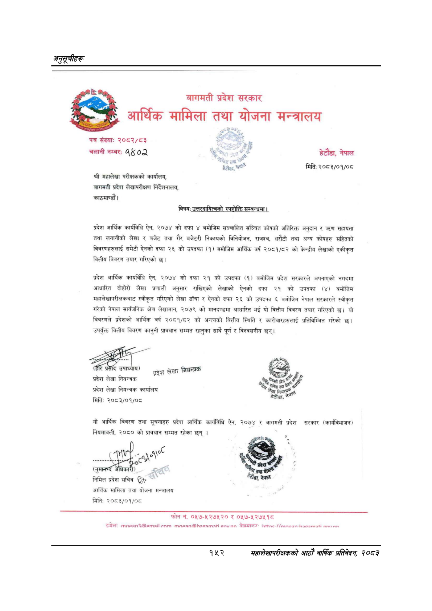

# Page 182 QA

## Rendered page


## Extracted text

```text
अनुतूचीहरू
बागमती प्रदेश सरकार
आर्थिक मामिला तथा योजना मन्त्रालय
पत्र संख्याः
२०८२/८३
चलानी नम्बरः
०८)
श्री महालेखा परीक्षकको कार्यालय, बागमती प्रदेश लेखापरीक्षण निर्देशनालय, काठमाण्डौं |
विषय: उत्तरदायित्वको स्पष्टोक्ति सम्बन्धमा।
प्रदेश आर्थिक कार्यविधि ऐन, २०७४ को दफा ४ बमोजिम सञ्चालित सञ्चित कोषको अतिरिक्त अनुदान सहायता तथा लगानीको लेखा र बजेट तथा गैर बजेटरी निकायको विनियोजन, राजश्व, धरौटी तथा अन्य कोषहरु सहितको विवरणहरुलाई समेटी ऐनको दफा २६ को उपदफा (१) बमोजिम आर्थिक वर्ष २०८१/८२ को केन्द्रीय लेखाको एकीकृत वित्तीय विवरण तयार गरिएको )
प्रदेश आर्थिक कार्यविधि ऐन, २०७४ को दफा २१ को उपदफा (१। बमोजिम प्रदेश सरकारले अपनाएको नगदमा आधारित दोहोरो लेखा प्रणाली अनुसार राखिएको लेखाको ऐनको दफा २१ को उपदफा (४। बमोजिम महालेखापरीक्षकबाट स्वीकृत गरिएको लेखा ढाँचा र ऐनको दफा २६ को उपदफा ६ वमोजिम नेपाल सरकारले स्वीकृत गरेको नेपाल सार्वजनिक क्षेत्र लेखामान, २०७९ को मानदण्डमा आधारित भई यो वित्तीय विवरण तयार गरिएको छ। यो विवरणले प्रदेशको आर्थिक वर्ष २०८१/८२ को अन्त्यको वित्तीय स्थिति र कारोवारहरुलाई प्रतिविम्बित गरेको छ। उपर्युक्त वित्तीय विवरण कानुनी प्रावधान सम्मत रहनुका साथै पूर्ण र विश्वसनीय छन्‌।
ड्र
२५५
पण
तै
बल
हेटौँडा,
भि,
जुल
नेपाल
ड्र
प्रदेश लेखा नियन्त्रक
प्रदेश लेखा नियन्त्रक प्रदेश लेखा नियन्त्रक कार्यालय
२५५
पण
तै
बल
हेटौँडा,
मिति:
२०८३/०१/०८
यी आर्थिक विवरण तथा सूचनाहरु प्रदेश आर्थिक कार्यविधि ऐन, २०७४ र बागमती प्रदेश सरकार (कार्यविभाजन) नियमावली, २०८० को प्रावधान सम्मत रहेका छन्‌। ) >
भि,
जुल
निमित्त प्रदेश सचिव €” आर्थिक मामिला तथा योजना मन्त्रालय
नेपाल
मिति:
२०८३/०१/०८
फोन नं. ०५७-५२७५२० ०५७-५२७५१८
डम्रेल: ०७०७ ७७ चेबसारल" -/ मह
हेटौंडा, नेपाल
मिति: २०८३/०१/०८
१५२
महालेखापरीक्षकको आठौँ वाषिकि प्रतिवेदन २०८२
```

## Flags
- None
