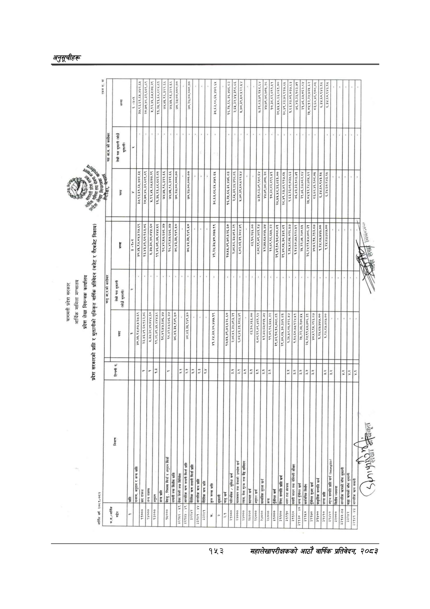

# Page 183 QA

## Rendered page


## Extracted text

```text
के
गा
६४४
८२०२ २२८० २६७ १२४ ए२४७:००७/२६

| रकम रू. मा ]                                                                                                                    | । न ।                                                                                                                                                | ६ -४०४ ३७,९३,६१,६५,४७२.६५ २०.७०,४८३२,६८९.०९ ५,१२,४५,६७.४७७,२९ ११.३५,९१,६८.८८२.५१ ७४,७५.९६,३२२.६६ ७४.७४५,९६,३२२.६६ ७०,२७.००.०००.०० 90,25,00,000 00 ३८,६३,८८,६४५,४७२.६४ १६,२५.६६,३६.४७६.०३ २.६५.३२,४४.३९८.८६ ५,७०,३१,४५०,१२२.४४ ७.३१,८३,७९.१५६८.६४ ४७,७९,७८.७०५.२८ १०.३८८२.८९१.४५१ २८,१५.४८.३३,८६१.०० २८.४९.२३.७२,९१७.८४५ 9.62,32.01,030.69 ७६,४३,३३,१०३.७१ २१,७६६७.०४२.८४ २४५,०४.१२,२४.७२५.६२ ८३,६८,४६,१०८.०५ ६,३४,६०.९४३.१५ ६,३४.६०,९४३.१२                 |
|---------------------------------------------------------------------------------------------------------------------------------|------------------------------------------------------------------------------------------------------------------------------------------------------|------------------------------------------------------------------------------------------------------------------------------------------------------------------------------------------------------------------------------------------------------------------------------------------------------------------------------------------------------------------------------------------------------------------------------------------------------------|
| जनामाककोकारबा                                                                                                                   | तेस्रो पक्ष भुक्तानी (सोझै । =]                                                                                                                      | &#124;                                                                                                                                                                                                                                                                                                                                                                                                                                                     |
| pro के गा [छ छ,                                                                                                                 | न [ v ३७,९३.६१,६५,४७२.६५ २०,७०,४८.३२,६८९.८९ ५,१२,४५,६७,४७७.२९ ११,३४५,९१,६८,८८२.८१ ७४,७५,९६,३२२.६६ ७४,७४५,९६,३२२.६६ ७०,२५,००.०००.०० . ७०,२७,००,०००.०० | &#124; 3०%७,०८६४,४७२/६४ ८,६३,८८,६४,४७२.६५ १६,२५,६६,३६,४७६.८३ २,६५,३२,४४,३९८.०६ ४५,७०,३१,४०,४२२.४५४ ७.३१.८३,७९,९१८,६४ ४७.७९,७८७०५.२८ १०,३८.८२.८९१.४१ २८.४४.४५८,३३,८६१.०० २८,४९,२३,७२,९१७.८४५ &#124; 3,63,२३,०१.०३७.६३] ७६,४३,३३,१०३.७१ २१.७६,६७.०६२.८४ २५,०४.१२,२४७२५.६२ ८३,६८,४६.९०८०४५ ६,३४.६०,९४३.१५ ६,३४.६०.९४३.१४५                                                                                                                                     |
| (बजेट र गैरबजेट निकाय)                                                                                                          | ५,३७,३८,४०,०४४.६० ना । I ४०,४५,१४५०४५२७.६९ २३,४३,४१,६०,९६२.०६ ११,४६,७१,४४,८४४.४५६ 4८,४२,४५७,६७६.४७ १८,४२,४७,६७६.४७ ७८,४३,३५,९४९.४० ७८.४३,३५,९४९.१०   | ४१,२४,३७,४०,४७७.१९ १७,४४,४९.७२,४२६.६० २,७८.४६,३७.७९३.२१ ६,०२.४३,३१,२८४-४९ [&#124; न3,1०.२६६:००]&#124; ८,०८९९.,०९.४८०१.९४ ४२,७७.८७.०४५.७४ ११,८९.९६.६४५.२२ २९,४२.१०.१८,०८८.८१ २९,४०,८४,३०,३४१.८१ &#124; 3,3::८०४०२६५७&#124; 4.१४.६०.७३.१२४.५१ २५,२२.७५.२७०.१४ २६,२४,११.४७.७०६.३१ ४०,४२.१५,२१३.८७                                                                                                                                                             |
| प्रदेश लेखा नियन्त्रक कार्यालय प्रदेश सरकारको प्राप्ति र भुक्तानीको एकिकृत वार्षिक प्रतिवेदन [] [_____  कलुमककोकारबा WA कातेबार | तेस्रो पश्न भुक्तानी । (सोझै भुक्तानी) v                                                                                                             | । -] [का &#124; == =                
```

## Flags
- table_page
- low_quality_table
