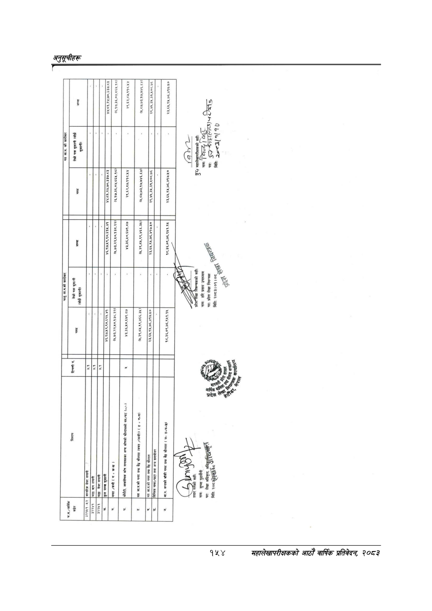

# Page 184 QA

## Rendered page


## Extracted text

```text
आर्थिक
सङ्गेत
विवरण
त]
३२१५१-५२
[जान्तरिक
बे
लगी
।
सेयर
लगानी
तेस्रो
पक
भुक्तानी
न
।
भुक्तानी)
४४.८१,२४.७०,३३७.९३
४४.८१,२४.७०,३३७.८३
(६,१७.३६,०४,८६५.१८।|
(६,१७.३६,०४.८६४.१८।।
२९,६२,८७,११८.४४
२९,६२.८७,११८.४४
५,२९,८४,९९,४६६.३५।
३२२४१
[बल
कालाती
कण
लगानी
सेवर
लगानी
ङ्लजम्बबुकती
४६,९७,४९,९०,६१५-७३
भ६,२७/४९,९०,६१५.५३
बचत
/कमी
क-ख
।
(८,७३,२२,५०,१३८.२२।|
(५,७३,२२,४०.१३८.२२।|
।
आकस्मिक
कोष
लगायतका
अन्य
कोषको
मौज्दातको
धप/घट
४३,३६,४०,६७१.८७
बन्न
।
न
यस्त
आ.व.को
नगद
तथा
मौज्दात
(बचत
/(कमी))
ङ
गनछ)
६५,२९,८५,९९,४६६.३५.
(४,
८७,७३.१७,७४६.६४)|
(४,
८७.७३,१७,७४६.६४|
२३,६५,९५,७६,४१७.४०
२३,६५,९५,७६,४१७.४०
२९,४५,३४५.३१,४५०८.७६
३९,४५,३५,३१,५०८.७६
चय
आ.व.को
नगद
तथा
बेद
म
नाफा/खाटा
तथा
अन्य
समावोजन
आ.व.
अन्तको
बाँकी
नगद
तथा
बेङ्ठ
मौज्दात
ज-
१८,३६,०९,७६,९५१.१५
१८.३६,०९,७६,९५१.१५
२३,६५,९४,७६,४१७.४५०
२३,६४५,९४,७६,४१७.४०
सही:
नामः
हरि
प्रसाद
उपाध्याय
पद:
प्रदेश
लेखा
नियन्त्रक
मिति:
२०८३।०१।०८
पछ
खुद
३
महालेखापरीकषकको
सही:
नामः
जिल्द
दूर,
भज्नउ
मितिः
२५-८.३(”७[
१०
२४४७
८२०२ २२८४ ४६७७ [ ए२%७०४/७७/८८
```

## Flags
- None
