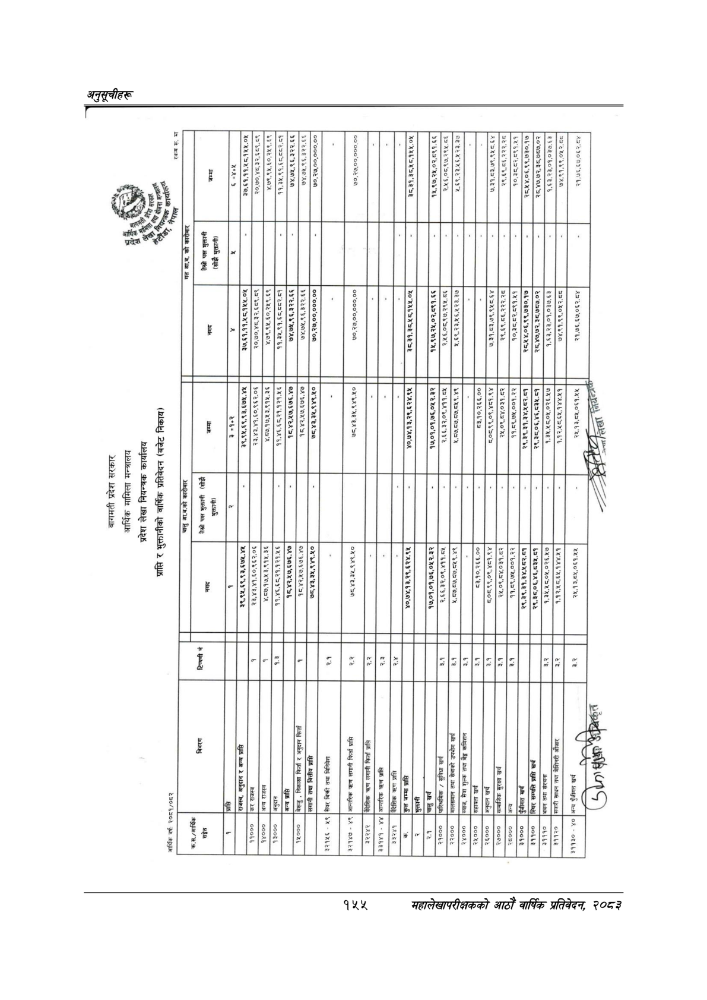

# Page 185 QA

## Rendered page


## Extracted text

```text
बागमती प्रदेश सरकार
आर्थिक मामिला मन्त्रालय
प्रदेश लेखा नियन्त्रक कार्यालय
प्राप्ति र भुक्तानीको वार्षिक प्रतिवेदन (बजेट निकाय)
आर्थिक बर्ष: २०८१/०८२
४४४
८२०९ २२८८ ४७०७ [ [

| wma@ew ] ।                       | ना                                  | । ६ २४०५                                  | ३७,६१,११,१८.१५५.०५ २०,७०,४८३२,६८९.८९                             | ४.७९,९५,६०,२५९.६९ ११,३५,९१,६८,८८२.५१   | ७४.७५.९६,३२२.६६                          | ७४,७५.९६,३२२. ७०,२७,००,०००.००                   | _                                |                                             | _                                 | ३८,३१,३८,५८,१५५.०५          | १५,९७,२५,०२,८९१.६६                                                      | ५.६९,२३,५६,५२३.३७                        | [  -]                                                     | २९,६९,८६.२२२.२८                 | १०,३८,८२,८९१.५१                                                | २८.५४.०६,९९,७३०.१७ २८,४७,७२,३८,७८७.०२                       | १,६३,२३,०१,०३७.६३ ७४.९१,९९,०५२.८८       | २१.७६,६७,०६२.८४                            |
|----------------------------------|-------------------------------------|-------------------------------------------|------------------------------------------------------------------|----------------------------------------|------------------------------------------|-------------------------------------------------|----------------------------------|---------------------------------------------|-----------------------------------|-----------------------------|-------------------------------------------------------------------------|------------------------------------------|-----------------------------------------------------------|---------------------------------|----------------------------------------------------------------|-------------------------------------------------------------|-----------------------------------------|--------------------------------------------|
| ।                                | तेस्रो पकन भुक्तानी (सोझै भुक्तानी) | “                                         |                                                                  | I                                      |                                          |                                                 | नि                               | ।                                           |                                   |                             |                                                                         |                                          |                                                           |                                 |                                                                |                                                             |                                         |                                            |
| न                                | ¥                                   | ३७,६१,११,१८,१५५.०४५                       | २०,७०,४८.३२.६८९.८९ ४.७९,९५,६०,२४९.६९                             | [ )                                    | ७४,७५,९६,३२२.६६                          | ७४.७५,९६,३२२.६६ ७०,२७,००,०००.००                 |                                  | लन्छन्न्न&#124;                             |                                   |                             | २.५5०८९७२९५०७६]                                                         |                                          | ७.३१,८३,७९,९५८.६४                                         | २९.६९.८६.,२२२.२८                | १०,३८.८२,८९१.४५१ २८,५४,०६,९९,७३०.१७ २८,४७,७२,३८,७८७.०२         | १,६३,२३,०१.०३७.६३                                           | ७४,९१.९९,०१५२.८८                        | २१,७६,६७.०६२.८४                            |
| ] [ । तेस्रो पक्ष भुक्तानी (सोझै | का । ।                              | ३ 5१०२ ] ३९,९५,६९,९३,६७५.४४ &#124; &#124; | २३,४३,४१.६०,९६२.०६ &#124; &#124; ४,५७.१७,४३.९१५.३६ &#124; &#124; | ११,४६,६८,२१.१२१.५६ &#124; &#124;       | &#124; १८४२,४७,६७६.४७ &#124; &#
```

## Flags
- table_page
- medium_quality_table
