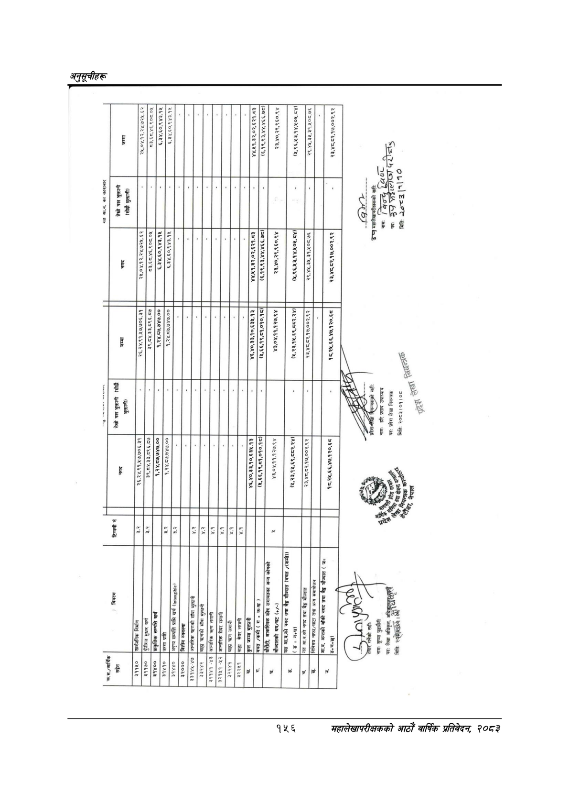

# Page 186 QA

## Rendered page


## Extracted text

```text
सत
आ.व.
का
काराबार
ना
।
२५,०४.१२,२४,७२४.
र
८३,६८,४६,९०८.०५
६,३४,६०,९४३.१५
६,३४.६०,९४३.१४५
४४.५१,३२,०२,६२१.८३
(६,१९,९३,४४,४६६.७८)
९८०२
छो
नाम:
सुष्मा
पुडासैनी
पद:
लेखा
अधिकृत,
गरिङ्दपुछकुलै
२३,४०,२९,९६०.९४
(५,९६,५३,१४,५०५.८४)
२९,४४५.३५,३१,५०८.७६
प्रदेश”
सही:
नाम:
हरि
प्रसाद
उपाध्याय
पद:
प्रदेश
लेखा
नियन्त्रक
मितिः
२०८३।०१।०८
ली
बात
बिवरण
टिप्पणी
नं
तेस्रो
पक्ष
भुक्तानी
(सोझै
तेस्रो
पक्ष
भुक्तानी
सङ्गेत
।
ना
।
।
न
।
न
।
भुक्तानी)
(सोझै
भुक्तानी)
_३११५०
[सार्वनिक
निमग
निर्माण
डर.र
२६,२४.९१,५७,७०६.३१
२६,२४,९१,१७,७०६.३१
२५,०४.१२,२४,७२५.६२
लि
_३११७०
|पृजीगत
सुधार
खर्च
३.२
३९.८४,३३,८९६.८७
३९,८४,३३,८९६.८७
८३,६८.४६.९०८.०४५
_३१४००
प्राकृतिक
सम्पत्ति
खर्च
३,२४,०७,७४७.००
३,२४/०७,७४७.००
६,३४,६०,९४३.१४५
[२]
३१४१०
ब्रत
प्रा
३.२
७
१,२४,८७,७४७.००
६,३४,६०९४३१५|
३१४४०
।|अपृष्य
सम्पत्ति
प्राप्ति
खर्च
३.२
३३०००
वित्तीय
व्यवस्था
३३१४४५-४७
|आन्तरिक
त्रणको
साँवा
भुक्तानी
[४२
३२४२
|बाहा
त्रहणको
साँवा
भुक्तानी
४.२
३२१४१
-४३
[आन्तरिक
कण
लगानी
बहण
लगानी
४.१
३३९४९
४२
सेयर
लगानी
३]
३२२४१
[कल
ब्गलाणी
चण
लगानी
४१
।
३३२२५१
बुबाहा
सेयर
लगानी
४.१
जम्मा
भुक्तानी
४६,४०,३३,१०,४३५.१३
४६,४०,३३,१०,६३५.१३
४४,५१,३२,०२,६२१.८३
[_ग.
[क्कत
/कमी
(गनकख।
/कमी
ग
५
क-ख
(५,६६,१९,०१,०१०.१८)|
।-]
०,५६,१९,७१,०१०.१८|
(६,१९,९३,४४,४६६.७८)|
क
नको
४३,०४,११.१२७.९४
४३,०४.११.१२७.९४
२३,४०,२९,९६०.९४
जगको
धप/घट
न.
सक्न
ने
लिखत
कला
(४,
२३,१४,६९,५८२.२४)
।
(४,२३,१५,
६९,
२.२४)
न्ल्त्त्ति
'गत
आ.व.को
नगद
तथा
बैङ्ग
मौज्दात
२३,४८,८२.१७,००२.९२
लका
२३,४८.८२.१७.००२.९२
२९,४५,३५,३१,५०८.७६
लि
[बच
|विनिमय
नाफा/घाटा
तथा
अन्य
समायोजन
।
७]
ज.
न््ला
१८,२५,६६,४७,१२०.६८
।
१८,२५,६६,४७,१२०.६८
२३,४८,८२,१७,००२.९२
।
महालेखापरीक्षकको
सही:
२३,४८,८२,१७,००२.९२
जिल्द
छर
(८८५८
नामः
थ
तीन:
छ
३
६८
५५१७
मितिः
२०३
(१११०
३४४
८२०९ २२८८ ४७०७ [ [

|  |  |
| --- | --- |
|  |  |
|  | छु |
|  |  |
|  |  |
|  |  |
|  | नि: |
|  |  |
| =५२ | ५५५५३ त |
|  | हु ३ ४ ११ हट ११११ १११ |
```

## Flags
- table_page
- medium_quality_table
