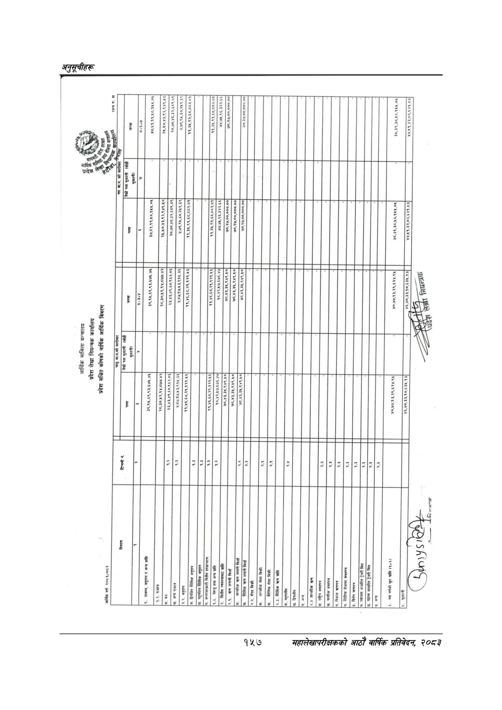

# Page 187 QA

## Rendered page


## Extracted text

```text
।
१४५१०
६१४०
२०% २२६८ ४८७ ( २४६२०८/८२२/८२६

|                                                                                                 |                        |             | “ 3 छ ३७,६१.११,४८.१४५.०४५                      | २४.४५०,४३,९२,९४९६.४८ २०.७०,४८.३२,६८९.८९&#124; ४,.७९,१४५.६०,२४५९.६९   | नि 75:72-722] १,३५,९१,६८,८८२.५१                                                                        | ७४,७४५,.९६,३२२.६६                                                                          | ७०,२७,००,०००.००] ©0,3,00,000 00   |                                                                                   |                            |                                                            |                                                                                     |                                      |            | ३८३१,३८,४५८.१४५५.०४                      | ४४.५१.३२,०२,६२१.०३           |
|-------------------------------------------------------------------------------------------------|------------------------|-------------|------------------------------------------------|----------------------------------------------------------------------|--------------------------------------------------------------------------------------------------------|--------------------------------------------------------------------------------------------|-----------------------------------|-----------------------------------------------------------------------------------|----------------------------|------------------------------------------------------------|-------------------------------------------------------------------------------------|--------------------------------------|------------|------------------------------------------|------------------------------|
|                                                                                                 |                        |             | RS RERTX IR                                    | &#124; २०५०७३,९२/९४२:४८ २०,७०,४८,३२.६८९.८९ ४.७९,९५,६०,२५९.६९,        | ११.३४.९१,६८.८८२.०१ ७४.७४.९६,३२२.६६&#124;                                                               |                                                                                            |                                   |                                                                                   |                            |                                                            |                                                                                     |                                      |            | ३८,३१.३८.५८,१५४५.०५                      | ४४.४५१.३२,०२.६२१.८३          |
| आर्थिक मामिला मन्त्रालय प्रदेश लेखा नियन्त्रक कार्यालय प्रदेश सञ्चित कोषको वार्षिक आर्थिक विवरण |                        | &#124; जा g |                                                | २८.३०,४९,१४,८७७.४२&#124; &#124; &#124;                               | [&#124; e &#124;                                                                                       | १८,४२,४७.६७६.४७ e                                                                          |                                   |                                                                                   |                            |                                                            |                                                                                     |                                      |            | ४०,७४,१३,२९,६२४.९५                       | नपानबनबर्गु &#124; लियन्त्रक |
| आर्थिक मामिला मन्त्रालय प्रदेश लेखा नियन्त्रक कार्यालय प्रदेश सञ्चित कोषको वार्षिक आर्थिक विवरण | पचढुमककेकारीबा ले कारी |             |                                                | [._»”                                                                | ।                                                                                                      |                                                                             
```

## Flags
- table_page
- low_quality_table
