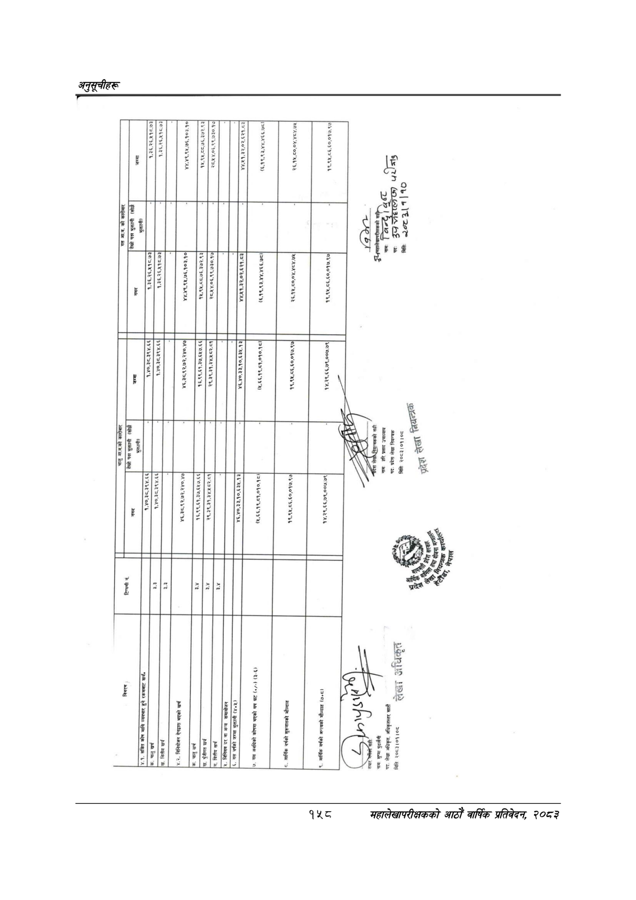

# Page 188 QA

## Rendered page


## Extracted text

```text
हल
२४४७
२०% २२६८ ४८७ ( २४६२०८/८२२/८२६

|                                               | =                                         | १.३६,२६,४१८.७३&#124; 1] १.३६,२६,४१८.७३                  | ४४,४९,९४,७६,१०३.१०,                |                                                   |                                                                      | (६,१९,९३,४४,४६६-७८।&#124;                | २६,१५,८०,०४,४८४.७४                 | १९,९५,८६,६०.०१७.९७&#124;             | s ul=lg                                                           |
|-----------------------------------------------|-------------------------------------------|---------------------------------------------------------|------------------------------------|---------------------------------------------------|----------------------------------------------------------------------|------------------------------------------|------------------------------------|--------------------------------------|-------------------------------------------------------------------|
| जाज्ककोकाीका WA बो कारी                       | तेस्रो पक्ष भुक्तानी 7 भुक्तानी)          | १.३६,२६,४५१८.७३&#124; लि &#124;                         |                                    | २८.४४.०६,९९,७३०.१५७&#124;                         | 7172)                                                                |                                          |                                    | १९,९४५,८६,६०,०१७.९७&#124; ।          | et v ™ का w 39N मितिः oz2&#124;1]10                               |
| [____                                         | १४०,३८.३९४.६६]&#124;                      | &#124;                                                  |                                    | १४५,९४५,८८,७६,३७२.९३&#124;                        | श्:?:77777                                                           | (६,१९,९३,४४,४६६.७८।&#124;                | २६,१५,८०,०४,४८४.७४५                |                                      |                                                                   |
| न                                             | ।                                         |                                                         |                                    |                                                   |                                                                      |                                          | १९,९४,८६,६०.०१७.९७&#124;           | १४.२९,६६,७९,००७.७९                   |                                                                   |
| चनुगाककोकरीका लने कारी तेस्रो पल भुक्तानी ।खे | भुक्तानी) 1217 -४०,३८,३९४.६६&#124;        | लि लि? . ¥0,35,3 Y. 44&#124;                            | I ४६,३८.९२,७२,२४०.४७&#124;         | २९.३९.३१,३४.४५८२.८१                               | उ३१०,०3५-1३&#124; .¥0,33,90,63X.13                                   | (४,६६,१९,८१,०१०.१८।&#124;                | १९,९४५,८६,६०,०१७.९५७&#124;         | १४.२९,६६,७९,००७.७९ । ।               | नाग: हरि प्रसाद उपाध्याय पद पढेश लेखा नियन्त्रक यी AR 2053101 108 |
| [______                                       |                                           |                                                         |                                    | १६,९९,६१,३७,६४७.६६                                | [मय                                                                  |                                          |                                    |                                      |                                                                   |
| [_ -                                          |                                           | &#124; उ रा .                                           |                                    | ॥ &#124; पा ] [ गा ]                              |                                                                      |                                          | <. आर्थिक वर्षको सुरूवातको मौज्दात | आर्थिक वर्षको अन्त्यको मौज्दात (७:८। |                                      
```

## Flags
- table_page
- low_quality_table
